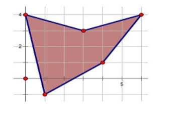
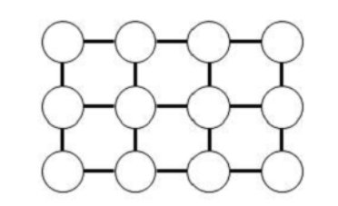
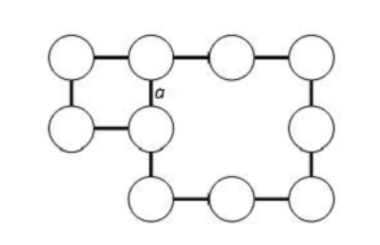

# [题目链接](https://www.lanqiao.cn/courses/2786/learning/?id=67149)
# A组真题
## 题目结构
|       题目       |   类型   |
| :--------------: | :------: |
| 第一题  随意组合 | 结果填空 |
|  第二题  拼棋盘  | 结果填空 |
|   第三题  打靶   | 代码填空 |
| 第四题  路径之谜 | 程序设计 |
|   第五题  碱基   | 程序设计 |
|  第六题  圆圈舞  | 程序设计 |

****

## 第一题 一步之遥

* **问题重现**

  >从昏迷中醒来，小明发现自己被关在X星球的废矿车里。
  >矿车停在平直的废弃的轨道上。
  >他的面前是两个按钮，分别写着“F”和“B”。
  >
  >小明突然记起来，这两个按钮可以控制矿车在轨道上前进和后退。
  >按F，会前进97米。按B会后退127米。
  >透过昏暗的灯光，小明看到自己前方1米远正好有个监控探头。
  >他必须设法使得矿车正好停在摄像头的下方，才有机会争取同伴的援助。
  >或许，通过多次操作F和B可以办到。
  >
  >矿车上的动力已经不太足，黄色的警示灯在默默闪烁…
  >每次进行 F 或 B 操作都会消耗一定的能量。
  >小明飞快地计算，至少要多少次操作，才能把矿车准确地停在前方1米远的地方。
  >
  >请填写为了达成目标，最少需要操作的次数。
  >
  >注意，需要提交的是一个整数，不要填写任何无关内容（比如：解释说明等）

* **解题思路**、

  就是判断多少次前进能够等于多少次后退+1即可。我们从小到大枚举即可。

* **代码**

* **答案**

  $97$

****

## 第二题 凑平方数

* **问题重现**

  >把0~9这10个数字，分成多个组，每个组恰好是一个平方数，这是能够办到的。
  >比如：0, 36, 5948721
  >
  >再比如：
  >1098524736
  >1, 25, 6390784
  >0, 4, 289, 15376
  >等等…
  >
  >注意，0可以作为独立的数字，但不能作为多位数字的开始。
  >分组时，必须用完所有的数字，不能重复，不能遗漏。
  >
  >如果不计较小组内数据的先后顺序，请问有多少种不同的分组方案？
  >
  >注意：需要提交的是一个整数，不要填写多余内容。

* **解题思路**

  我们首先肯定是要将所有满足条件的平方数都给存储起来。那么之后怎么对它们进行处理呢？==我们可以对这些数进行组合，即连接在一起，利用$dfs$搜索，那么剪枝即是当组合数长度大于$10$时退出，而符合条件即是长度为$10$且出现了唯一的$0->9$。== 具体看AC代码。

* **代码**

  

****

## 第三题 棋子换位

* **问题重现**

  >有n个棋子A，n个棋子B，在棋盘上排成一行。
  >它们中间隔着一个空位，用“.”表示，比如：
  >
  >AAA.BBB
  >
  >现在需要所有的A棋子和B棋子交换位置。
  >移动棋子的规则是：
  >
  >A棋子只能往右边移动，B棋子只能往左边移动。
  >每个棋子可以移动到相邻的空位。
  >每个棋子可以跳过相异的一个棋子落入空位（A跳过B或者B跳过A）。
  >AAA.BBB 可以走法：
  >移动A ==> AA.ABBB
  >移动B ==> AAAB.BB
  >
  >跳走的例子：
  >AA.ABBB ==> AABA.BB
  >
  >以下的程序完成了AB换位的功能，请仔细阅读分析源码，填写划线部分缺失的内容。
  >
  >```c++
  >#include <stdio.h>
  >#include <string.h>
  >
  >void move(char* data, int from, int to)
  >{
  >	data[to] = data[from];
  >	data[from] = '.';
  >}
  >
  >int valid(char* data, int k)
  >{
  >	if(k<0 || k>=strlen(data)) return 0;
  >	return 1;
  >}
  >
  >void f(char* data)
  >	{
  >	int i;
  >	int tag;
  >	int dd = 0; // 移动方向
  >
  >	while(1){
  >			tag = 0;
  >		for(i=0; i<strlen(data); i++){
  >			if(data[i]=='.') continue;
  >			if(data[i]=='A') dd = 1;
  >			if(data[i]=='B') dd = -1;
  >
  >			if(valid(data, i+dd) && valid(data,i+dd+dd) 
  >						&& data[i+dd]!=data[i] && data[i+dd+dd]=='.'){ 
  >			//如果能跳... 
  >				move(data, i, i+dd+dd);
  >				printf("%s\n", data);
  >				tag = 1;
  >				break;
  >			}
  >		}
  >
  >		if(tag) continue;
  >		
  >		for(i=0; i<strlen(data); i++){
  >					if(data[i]=='.') continue;
  >			if(data[i]=='A') dd = 1;
  >			if(data[i]=='B') dd = -1;			
  >
  >			if(valid(data, i+dd) && data[i+dd]=='.'){ 
  >				 			// 如果能移动...
  >				if( ______________________ ) continue;  //填空位置 
  >				move(data, i, i+dd);
  >				printf("%s\n", data);
  >				tag = 1;
  >				break;
  >			}
  >		}
  >
  >		if(tag==0) break;					
  >			}
  >}
  >
  >int main()
  >	{
  >	char data[] = "AAA.BBB";	
  >	f(data);
  >	return 0;
  >}
  >```
  >
  >注意：只提交划线部分缺少的代码，不要复制已有代码或填写任何多余内容。
  
* **解题思路**

  我们是为了实现棋子换位，而$f$函数即可实现这个功能，不然发现，上半部分是判断是否可以跳过相异的棋子，同时$tag$标记则是判断是否已经执行一次换位操作，那么在下半部分则是判断是否可以移动到相邻的空位，那么在$for$循环内部，先是判断是否越界，然后就再次进行一次$if$判断，也就是我们要填的空，那么这里为什么要填这个呢？我们如果不填会怎样，我们先打印输出如下：

  >AA.ABBB
  >AABA.BB
  >AAB.ABB
  >A.BAABB
  >.ABAABB
  >BA.AABB
  >B.AAABB

  我们发现，这并没有达到我们的效果，这是因为我们将剩余移动的字母都给堵住了，所以这个$if$判断就是判断左右两边的字母是否都不相同。因为如果相同，那么我们移动会将左边相同的字母堵住，就移动不了了。则答案可知。

* **答案**

  ```c++
  valid(data,i+dd+dd)&&valid(data,i-dd)&&data[i+dd+dd]==data[i-dd]
  ```

****

## 第四题 机器人塔

* **问题重现**

  >机器人塔
  >
  >X星球的机器人表演拉拉队有两种服装，A和B。
  >他们这次表演的是搭机器人塔。
  >
  >类似：
  >
  >
  >
  >队内的组塔规则是：
  >
  >A 只能站在 AA 或 BB 的肩上。
  >B 只能站在 AB 或 BA 的肩上。
  >
  >你的任务是帮助拉拉队计算一下，在给定A与B的人数时，可以组成多少种花样的塔。
  >
  >输入一行两个整数 M 和 N，空格分开（0<M,N<500）,分别表示A、B的人数，保证人数合理性。
  >
  >要求输出一个整数，表示可以产生的花样种数。
  >
  >例如：
  >用户输入：
  >1 2
  >
  >程序应该输出：
  >3
  >
  >再例如：
  >用户输入：
  >3 3
  >
  >程序应该输出：
  >4
  >
  >资源约定：
  >峰值内存消耗 < 256M
  >CPU消耗 < 1000ms
  >
  >请严格按要求输出，不要画蛇添足地打印类似：“请您输入…” 的多余内容。
  >
  >所有代码放在同一个源文件中，调试通过后，拷贝提交该源码。
  >
  >注意: main函数需要返回0
  >注意: 只使用ANSI C/ANSI C++ 标准，不要调用依赖于编译环境或操作系统的特殊函数。
  >注意: 所有依赖的函数必须明确地在源文件中 #include ， 不能通过工程设置而省略常用头文件。
  >
  >提交时，注意选择所期望的编译器类型。

* **解题思路**

  由于每一行都可以由下一行决定，所以我们可以枚举最后一行然后确定，之后判断是否可行。为了方便，我们可以采用二进制的形式来形象枚举最后一行，即从$00...0->11...1$，那么对应$1$就表示$a$，$0$表示$B$。具体见AC代码。

* **代码**

  

## 第五题 广场舞

* **问题重现**

  >LQ市的市民广场是一个多边形，广场上铺满了大理石的地板砖。
  >
  >地板砖铺得方方正正，就像坐标轴纸一样。 
  >以某四块砖相接的点为原点，地板砖的两条边为两个正方向，一块砖的边长为横纵坐标的单位长度，则所有横纵坐标都为整数的点都是四块砖的交点（如果在广场内）。
  >
  >广场的砖单调无趣，却给跳广场舞的市民们提供了绝佳的参照物。每天傍晚，都会有大批市民前来跳舞。 
  >舞者每次都会选一块完整的砖来跳舞，两个人不会选择同一块砖，如果一块砖在广场边上导致缺角或者边不完整，则没人会选这块砖。 
  >（广场形状的例子参考下图）
  >
  >
  >
  >现在，告诉你广场的形状，请帮LQ市的市长计算一下，同一时刻最多有多少市民可以在广场跳舞。
  >
  >【输入格式】
  >
  > 输入的第一行包含一个整数n，表示广场是n边形的（因此有n个顶点）。 
  >接下来n行，每行两个整数，依次表示n边形每个顶点的坐标（也就是说广场边缘拐弯的地方都在砖的顶角上。数据保证广场是一个简单多边形。
  >
  >【输出格式】
  >
  > 输出一个整数，表示最多有多少市民可以在广场跳舞。
  >
  >【样例输入】
  >
  >5 
  >
  >3 3
  >
  > 6 4
  >
  > 4 1
  >
  > 1 -1
  >
  > 0 4
  >
  >【样例输出】
  >
  > 7
  >
  >【样例说明】
  >
  > 广场如图1.png所示，一共有7块完整的地板砖，因此最多能有7位市民一起跳舞。
  >
  >【数据规模与约定】 
  >
  >对于30%的数据，n不超过100，横纵坐标的绝对值均不超过100。 
  >对于50%的数据，n不超过1000，横纵坐标的绝对值均不超过1000。 
  >对于100%的数据，n不超过1000，横纵坐标的绝对值均不超过100000000（一亿）。
  >
  >资源约定： 峰值内存消耗 < 256M CPU消耗 < 1000ms
  >
  >请严格按要求输出，不要画蛇添足地打印类似：“请您输入…” 的多余内容。
  >
  >所有代码放在同一个源文件中，调试通过后，拷贝提交该源码。
  >
  >注意: main函数需要返回0 注意: 只使用ANSI C/ANSI C++ 标准，不要调用依赖于编译环境或操作系统的特殊函数。 注意: 
  >所有依赖的函数必须明确地在源文件中 #include ， 不能通过工程设置而省略常用头文件。
  >
  >提交时，注意选择所期望的编译器类型。

* **解题思路**

  题目还是比较清晰的，就是让我们判断在这多边形内存在多少个完整方格。那么首先我们得知道$pnpoly$算法，它可以判断一个点是否在多边形内部，模板如下：

  ```c++
  int pnpoly(int n, double pos_x, double pos_y, double vert[][2])
  {
      int i, j, c = 0;
  	
  	for (i = 0, j = n - 1; i < n; j = i++)
  	{
  		if (((vert[i][1] > pos_y) != (vert[j][1] > pos_y)) &&
  			(pos_x < (vert[j][0] - vert[i][0]) * (pos_y - vert[i][1]) / (vert[j][1] - vert[i][1]) + vert[i][0]))
  		{
  			c = !c;
  		}
  	}
  	
  	return c;
  
  }
  
  ```

  那么判断一个方格是否在多边形内即判断它的四个点是否在内部即可。对于枚举范围我们需要从$(x_{min},y_{min})$枚举到$x_{max},y_{max}$。统计满足条件的即可得出答案。

* **代码**

## 第六题 生成树计数（待补）

* **问题重现**

  >给定一个 n*m 的格点图，包含 n 行 m 列共 n*m 个顶点，相邻的顶点之间有一条边。
  >给出了一个3*4的格点图的例子。
  >
  >如果在图中删除部分顶点和其相邻的边，如上图删除第2行第3列和第3行第1列的顶点后，如下图所示。
  >
  >
  >
  >图的生成树指包含图中的所有顶点和其中的一部分边，使得任意两个顶点之间都有由边构成的唯一路径。如果两个生成树包含有不同的边即被认为不同，则上图中共有31种不同的生成树，其中a边不选有10种，a边选有21种。
  >给出格点图中保留的顶点的信息，请计算该图一共有多少种不同的生成树。
  >
  >【输入格式】
  >输入的第一行包含两个整数n, m，用空格分隔，表示格点图的行数和列数。
  >接下来n行，每行m个字母（中间没有分隔字符），每个字母必然是大写E或大写N，E表示对应的顶点存在，N表示对应的顶点不存在。保证存在至少一个顶点。
  >
  >【输出格式】
  >输出一行，包含一个整数，表示生成树的个数。答案可能很大，你只需要计算答案除以1000000007的余数即可。
  >
  >【样例输入】
  >3 4
  >EEEE
  >EENE
  >NEEE
  >
  >【样例输出】
  >31
  >
  >【数据规模与约定】
  >对于10%的数据，1<=n<=2。
  >对于30%的数据，1<=n<=3。
  >对于40%的数据，1<=n<=4。
  >对于50%的数据，1<=n<=5。
  >另有20%的数据，1<=n*m<=12。
  >另有10%的数据，1<=m<=15。
  >对于100%的数据，1<=n<=6，1<=m<=100000。