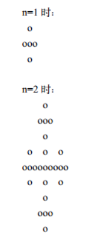

[TOC]


# [题目链接](https://www.lanqiao.cn/courses/2786/learning/?id=67149)

# A组真题

##  题目结构

|  题目  |   类型   | 分值 |
| :----: | :------: | :--: |
| 第一题 | 结果填空 | 5分  |
| 第二题 | 结果填空 | 7分  |
| 第三题 | 结果填空 | 9分  |
| 第四题 | 结果填空 | 13分 |
| 第五题 | 代码填空 | 11分 |
| 第六题 | 程序设计 | 17分 |
| 第七题 | 程序设计 | 19分 |
| 第八题 | 程序设计 | 21分 |
| 第九题 | 程序设计 | 23分 |
| 第十题 | 程序设计 | 25分 |

****

# 第一题 分数

* **问题重现**

  >1/1 + 1/2 + 1/4 + 1/8 + 1/16 + .... 
  >每项是前一项的一半，如果一共有20项,求这个和是多少，结果用分数表示出来。
  >类似：3/2当然，这只是加了前2项而已。分子分母要求互质。
  >
  >**输出**
  >
  >按格式输出答案

* **解题思路**

  这是一个等比数列，首项为$1$，公比为$1/2$，那么根据等比数列求和公式我们可得$s=\frac{a_1(1-q^n)}{1-q}$，求出分子分母，再利用欧几里得算法约分即可得到答案。

* **代码**

* **答案**

  $1048575/524288$

****

# 第二题 星期一

* **问题重现**

  >整个$20$世纪($1901$年$1$月$1$日至$2000$年$12$月$31$日之间)，一共有多少个星期一？
  >(不要告诉我你不知道今天是星期几)
  >
  >**输出**
  >
  >输出一个整数表示答案

* **解题思路**

  先求出从$1901$年$1$月$1$日至$2000$年$12$月$31$日之间有多少天，然后我们需要确定$2000$年$12$月$31$日是星期几，这我们可以通过日历来查看，也可以直接根据当前日期推回去，知道了之后，我们就可以通过对$7$整除和求余来判断共有几天了。

* **代码**

* **答案**

  $5217$

****

# 第三题 乘积尾零

* **问题重现**

  >如下的10行数据，每行有10个整数，请你求出它们的乘积的末尾有多少个零？
  >
  >```c++
  >5650 4542 3554 473 946 4114 3871 9073 90 4329 
  >2758 7949 6113 5659 5245 7432 3051 4434 6704 3594 
  >9937 1173 6866 3397 4759 7557 3070 2287 1453 9899 
  >1486 5722 3135 1170 4014 5510 5120 729 2880 9019 
  >2049 698 4582 4346 4427 646 9742 7340 1230 7683 
  >5693 7015 6887 7381 4172 4341 2909 2027 7355 5649 
  >6701 6645 1671 5978 2704 9926 295 3125 3878 6785 
  >2066 4247 4800 1578 6652 4616 1113 6205 3264 2915 
  >3966 5291 2904 1285 2193 1428 2265 8730 9436 7074 
  >689 5510 8243 6114 337 4096 8199 7313 3685 211 
  >```
  >
  >输出
  >
  >输出一个整数表示答案

* **解题思路**

  我们要知道，==能构成相乘为$0$的最小因子对是$2$与$5$== ，所以我们实际上就是看这些数有多少个$2$因子和$5$因子。取最小的数量即是答案。

* **代码**

* **答案**

  $31$

****

# 第四题 第几个幸运数

* **问题重现**

  >到x星球旅行的游客都被发给一个整数，作为游客编号。
  >x星的国王有个怪癖，他只喜欢数字3,5和7。
  >国王规定，游客的编号如果只含有因子：3,5,7,就可以获得一份奖品。
  >前10个幸运数字是：3 5 7 9 15 21 25 27 35 45，因而第11个幸运数字是：49
  >小明领到了一个幸运数字 59084709587505。
  >去领奖的时候，人家要求他准确说出这是第几个幸运数字，否则领不到奖品。
  >请你帮小明计算一下，59084709587505是第几个幸运数字。
  >
  >**输出**
  >
  >输出一个整数表示答案

* **解题思路**

  看到这个问题我们应该都会想到利用$set$容器吧，因为它会自动排序$+$去重，所以我们只要用最初始的元素$3,5,7$不停的去更新。这里需要注意的就是我们选择更新点的时候是选取比上一个更新点第一个大于它的，这可以利用$upper\_bound$函数来实现，这样才能确保每一个元素都被求到了。最后输出容器的大小即可。

* **代码**

* **答案**

  $1905$

****

# 第五题 打印图形

* **问题重现**

  >   如下的程序会在控制台绘制分形图（就是整体与局部自相似的图形）。 当n=1,2的时候，输出如下： 请仔细分析程序，并填写划线部分缺少的代码。
  >
  >    
  >
  >   源程序:
  >
  >   ```c++
  >   #include <stdio.h>
  >   #include <stdlib.h>
  >   
  >   void show(char* buf, int w){
  >       int i,j;
  >       for(i=0; i<w; i++){
  >           for(j=0; j<w; j++){
  >               printf("%c", buf[i*w+j]==0? ' ' : 'o');
  >           }
  >           printf("\n");
  >       }
  >   }
  >   
  >   void draw(char* buf, int w, int x, int y, int size){
  >       if(size==1){
  >           buf[y*w+x] = 1;
  >           return;
  >       }
  >   
  >       int n = _________________________ ; //填空
  >   
  >       draw(buf, w, x, y, n);
  >       draw(buf, w, x-n, y ,n);
  >       draw(buf, w, x+n, y ,n);
  >       draw(buf, w, x, y-n ,n);
  >       draw(buf, w, x, y+n ,n);
  >   }
  >   
  >   int main()
  >   {
  >       int N = 3;
  >       int t = 1;
  >       int i;
  >       for(i=0; i<N; i++) t *= 3;
  >   
  >       char* buf = (char*)malloc(t*t);
  >       for(i=0; i<t*t; i++) buf[i] = 0;
  >   
  >       draw(buf, t, t/2, t/2, t);
  >       show(buf, t);
  >       free(buf);
  >   
  >       return 0;
  >   }
  >   ```

* **解题思路**

  题目中是利用一维数组来实现二维画布的。我们看图形会发现，其实$n-1$的图形就是$n$的图形的上下左右的子图。所以，程序是利用递归来实现的，又因为$n$每$+1$，图形的边长就扩大$3$倍，程序中的$draw$函数参数也很明显，$x,y$代表中央坐标，$size$表示当前图形的边长，而之后递归求解的就是中左右上下子图，所以传递的$n$就是子图的边长大小，故$n=size/3$。

* **答案**

  $size/3$

****

# 第六题 航班时间

* **问题重现**

  >小h前往美国参加了蓝桥杯国际赛。小h的女朋友发现小h上午十点出发，上午十二点到达美国，于是感叹到“现在飞机飞得真快，两小时就能到美国了”。
  >小h对超音速飞行感到十分恐惧。仔细观察后发现飞机的起降时间都是当地时间。由于北京和美国东部有12小时时差，故飞机总共需要14小时的飞行时间。
  >不久后小h的女朋友去中东交换。小h并不知道中东与北京的时差。但是小h得到了女朋友来回航班的起降时间。小h想知道女朋友的航班飞行时间是多少。
  >对于一个可能跨时区的航班，给定来回程的起降时间。假设飞机来回飞行时间相同，求飞机的飞行时间。
  >
  >**输入**
  >
  >一个输入包含多组数据。
  >输入第一行为一个正整数T，表示输入数据组数。
  >每组数据包含两行，第一行为去程的 起降 时间，第二行为回程的 起降 时间。
  >起降时间的格式如下
  >
  >h1:m1:s1 h2:m2:s2
  >
  >h1:m1:s1 h3:m3:s3 (+1)
  >
  >h1:m1:s1 h4:m4:s4 (+2)
  >
  >表示该航班在当地时间h1时m1分s1秒起飞，
  >第一种格式表示在当地时间 当日 h2时m2分s2秒降落
  >第二种格式表示在当地时间 次日 h3时m3分s3秒降落。
  >第三种格式表示在当地时间 第三天 h4时m4分s4秒降落。
  >对于此题目中的所有以 h:m:s 形式给出的时间, 保证 ( 0<=h<=23, 0<=m,s<=59 ).
  >保证输入时间合法，飞行时间不超过24小时。
  >
  >**输出**
  >
  >对于每一组数据输出一行一个时间hh:mm:ss，表示飞行时间为hh小时mm分ss秒。
  >注意，当时间为一位数时，要补齐前导零。如三小时四分五秒应写为03:04:05。
  >
  >**样例输入**
  >
  >```c++
  >3
  >17:48:19 21:57:24
  >11:05:18 15:14:23
  >17:21:07 00:31:46 (+1)
  >23:02:41 16:13:20 (+1)
  >10:19:19 20:41:24
  >22:19:04 16:41:09 (+1)
  >```
  >
  >样例输出
  >
  >```c++
  >04:09:05
  >12:10:39
  >14:22:05
  >```

* **解题思路**

  我们这道题需要理解时差与起飞和降落时间的关系，设$A$地到$B$地的时差为$t$，从$A$地出发时间为$t_1$，$B$地降落时间为$t_2$。从$B$地出发时间为$t_3$，$A$地降落时间为$t_4$，飞机的飞行时间为$t_5$。

  则有：$t2-t_1+t=t_5\space\space\space\space\space\space (1)\space\space\space\space\space\space t4-t_3-t=t_5\space\space\space\space\space\space (2)$。

  联立$(1)(2)$式即可消去未知数时差$t$，那么$t_5=(t_4-t_3+t_2-t_1)/2$。

  知道了这个，我们就可以去写题了，对于这种题，我们可以有效的利用$scanf$，将其中的影响字符处理。这样就可以求解了。

* **代码**

****

# 第七题 三体攻击

* **问题重现**

  >三体人将对地球发起攻击。为了抵御攻击，地球人派出了 A × B × C 艘战舰，在太空中排成一个 A 层 B 行 C 列的立方体。其中，第 i 层第 j 行第 k 列的战舰（记为战舰 (i, j, k)）的生命值为 d(i, j, k)。
  >三体人将会对地球发起 m 轮“立方体攻击”，每次攻击会对一个小立方体中的所有战舰都造成相同的伤害。具体地，第 t 轮攻击用 7 个参数 lat, rat, lbt, rbt, lct, rct, ht 描述；
  >所有满足 i ∈ [lat, rat],j ∈ [lbt, rbt],k ∈ [lct, rct] 的战舰 (i, j, k) 会受到 ht 的伤害。如果一个战舰累计受到的总伤害超过其防御力，那么这个战舰会爆炸。
  >地球指挥官希望你能告诉他，第一艘爆炸的战舰是在哪一轮攻击后爆炸的。
  >
  >输入
  >
  >第一行包括 4 个正整数 A, B, C, m；
  >第二行包含 A × B × C 个整数，其中第 ((i − 1)×B + (j − 1)) × C + (k − 1)+1 个数为 d(i, j, k)；
  >第 3 到第 m + 2 行中，第 (t − 2) 行包含 7 个正整数 lat, rat, lbt, rbt, lct, rct, ht。
  >A × B × C ≤ 10^6, m ≤ 10^6, 0 ≤ d(i, j, k), ht ≤ 10^9。
  >
  >**输出**
  >
  >输出第一个爆炸的战舰是在哪一轮攻击后爆炸的。保证一定存在这样的战舰。
  >
  >**样例输入**
  >
  >```c++
  >2 2 2 3
  >1 1 1 1 1 1 1 1
  >1 2 1 2 1 1 1
  >1 1 1 2 1 2 1
  >1 1 1 1 1 1 2
  >```
  >
  >样例输出
  >
  >```c++
  >2
  >```
  >
  >**提示**
  >
  >在第 2 轮攻击后，战舰 (1,1,1) 总共受到了 2 点伤害，超出其防御力导致爆炸。

* **解题思路**

  这道题暴力求解应该很容易想到，模拟攻击遍历战舰即可，这样能过$50\%$的数据。但这我们肯定不满足，所以我们可能会换一种思路，由于攻击次数一定是在$[1,m]$之间的，所以我们可能会想到二分来枚举答案。可是我们如果枚举了答案之后，更新战舰的生命值呢？是直接一轮一轮遍历嘛，这样的效率更直接遍历是没什么区别的，所以这里会利用到差分数组，且是三维差分，这里只给出代码，之后补思路，（目前只会一维差分数组）。

* **暴力代码**
* **二分+三维差分处理代码**

****

# 第八题 全球变暖

* **问题重现**

  >你有一张某海域$N\times N$像素的照片，"."表示海洋、"#"表示陆地，如下所示：
  >
  >```c++
  >.......
  >.##....
  >.##....
  >....##.
  >..####.
  >...###.
  >.......
  >```
  >
  >其中"上下左右"四个方向上连在一起的一片陆地组成一座岛屿。例如上图就有2座岛屿。 
  >由于全球变暖导致了海面上升，科学家预测未来几十年，岛屿边缘一个像素的范围会被海水淹没。
  >具体来说如果一块陆地像素与海洋相邻(上下左右四个相邻像素中有海洋)，它就会被淹没。 
  >例如上图中的海域未来会变成如下样子：
  >
  >```c++
  >.......
  >.......
  >.......
  >.......
  >....#..
  >.......
  >.......
  >```
  >
  >请你计算：依照科学家的预测，照片中有多少岛屿会被完全淹没。
  >
  >**输入**
  >
  >第一行包含一个整数N。 (1 <= N <= 1000) 
  >以下N行N列代表一张海域照片。 
  >照片保证第1行、第1列、第N行、第N列的像素都是海洋。 
  >
  >**输出**
  >
  >一个整数表示答案。
  >
  >**样例输入**
  >
  >```c++
  >7 
  >.......
  >.##....
  >.##....
  >....##.
  >..####.
  >...###.
  >....... 
  >```
  >
  >样例输出
  >
  >```c++
  >1
  >```

* **解题思路**

  $dfs$判别连通分量，==思想是：首先以一个未被访问过的顶点作为起始顶点，沿当前顶点的边走到未访问过的顶点。当没有未访问过的顶点时，则回到上一个顶点，继续试探别的顶点，直至所有的顶点都被访问过。== 所以这道题我们就是判别有几个岛会被淹没，这就和我们搜索过程中判断每个顶点是否存在海洋有关，此题要注意的就是标记访问过的点，即将一个连通分量上的点全部标记。

* **代码**

****

# 第九题 倍数问题

* **问题重现**

  >众所周知，小葱同学擅长计算，尤其擅长计算一个数是否是另外一个数的倍数。
  >但小葱只擅长两个数的情况，当有很多个数之后就会比较苦恼。
  >现在小葱给了你 n 个数，希望你从这 n 个数中找到三个数
  >使得这三个数的和是 K 的倍数，且这个和最大。数据保证一定有解。 
  >
  >**输入**
  >
  >第一行包括 2 个正整数 n, K。
  >第二行 n 个正整数，代表给定的 n 个数。
  >1 <= n <= 10^5, 1 <= K <= 10^3，给定的 n 个数均不超过 10^8。
  >
  >**输出**
  >
  >输出一行一个整数代表所求的和。
  >
  >**样例输入** 
  >
  >```c++
  >4 3
  >1 2 3 4
  >```
  >
  >**样例输出**
  >
  >```c++
  >9
  >```

* **解题思路**

  这道题总共有两种解法，==第一种就是枚举法（不是暴力枚举），第二种则是背包问题动态规划==。先介绍第一种，我们在乎的其实就是模$k$的余数以及其数的大小。那么试想，如果有超过$3$个的且模$k$相同的数，我们怎么选择，如果要想和最大，我们肯定会选择其中最大的三个来试探（因为选取最多就是三个），所以如果我们不舍弃的话就会做很多无用功。那么处理的方法就是按模$k$的余数分类存储，然后分组排序，取前三个。然后就是可以直接枚举两个余数来确定另一个余数即可了，这种方法很好理解。那第二种就是背包问题解法了，按照我们上面的优化，我们还是取前三个数，不过现在不同了，涉及了一个选不选的问题，我们可以定义状态$dp[i][j]$来表示已经选了$i$个数且余数为$j$的当前最大和,那么状态转移方程就自然易得了:$dp[i][j]=max(dp[i][j],dp[i-1][((j-x)%K+K)%k]+x)$。

* **枚举优化代码**
* **动态规划优化代码**

****

# 第十题 付账问题

* **问题重现**

  >几个人一起出去吃饭是常有的事。但在结帐的时候，常常会出现一些争执。
  >现在有 n 个人出去吃饭，他们总共消费了 S 元。其中第 i 个人带了 ai 元。
  >幸运的是，所有人带的钱的总数是足够付账的。但现在问题来了：每个人分别要出多少钱呢？
  >为了公平起见，我们希望在总付钱量恰好为 S 的前提下，最后每个人付的钱的标准差最小。
  >这里我们约定，每个人支付的钱数可以是任意非负实数，即可以不是1分钱的整数倍。你需要输出最小的标准差是多少。
  >标准差的介绍：标准差是多个数与它们平均数差值的平方平均数，一般用于刻画这些数之间的“偏差有多大”。
  >形式化地说，设第 i 个人付的钱为 bi 元，那么标准差为 :
  >
  >
  > 输入
  >
  >第一行包含两个整数 n、S；
  >第二行包含 n 个非负整数 a1, ..., an。
  >n ≤ 5 × 10^5, 0 ≤ ai ≤ 10^9。
  >
  >输出
  >
  >输出最小的标准差，四舍五入保留 4 位小数。
  >保证正确答案在加上或减去 10^−9 后不会导致四舍五入的结果发生变化。
  >
  >样例输入 
  >
  >```c++
  >10 30
  >2 1 4 7 4 8 3 6 4 7
  >```
  >
  >样例输出
  >
  >```c++
  >0.7928
  >```

* **解题思路**

  这道题就是纯粹的贪心题，由于平均值已经确定了，所以我们就是想让每个人都尽量接近平均值。那么我们可以对这金额进行排序，从小到大遍历，如果低于平均值，那么肯定是要全部支付的，那么不够的钱则是由剩下的人来平摊，所以这里我们需要更新平均值。而如果高于，就只需要支付剩下的人需要平摊的钱即可。注意要实时更新平均值，也就是剩下的人需要平摊的钱数。

* **代码**

  