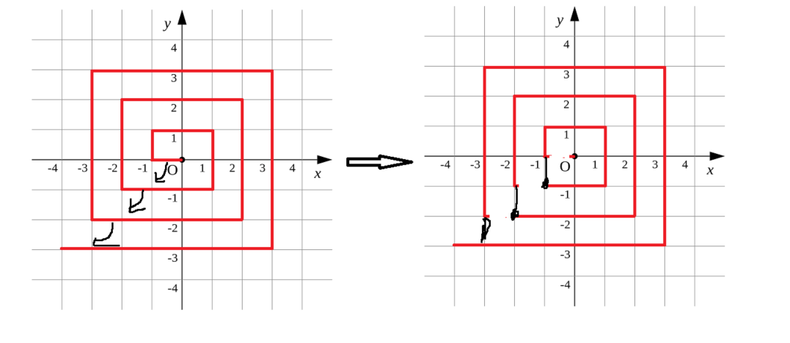

[TOC]


# [题目链接](https://www.lanqiao.cn/courses/2786/learning/?id=67149)

# B组真题

##  题目结构

|  题目  |   类型   | 分值 |
| :----: | :------: | :--: |
| 第一题 | 结果填空 | 5分  |
| 第二题 | 结果填空 | 7分  |
| 第三题 | 结果填空 | 13分 |
| 第四题 | 结果填空 | 17分 |
| 第五题 | 代码填空 | 9分  |
| 第六题 | 程序设计 | 11分 |
| 第七题 | 程序设计 | 19分 |
| 第八题 | 程序设计 | 21分 |
| 第九题 | 程序设计 | 23分 |
| 第十题 | 程序设计 | 25分 |

****

# 第一题 第几天

* **问题重现**

  >2000年的1月1日，是那一年的第1天。
  >那么，2000年的5月4日，是那一年的第几天？
  >
  >**输出**
  >
  >输出一个整数表示答案

* **解题思路**

  直接统计之间有多少天即可。

* **答案**

  $125$

****

# 第二题 明码

* **问题重现**

  >汉字的字形存在于字库中，即便在今天，16点阵的字库也仍然使用广泛。
  >16点阵的字库把每个汉字看成是16x16个像素信息。并把这些信息记录在字节中。
  >一个字节可以存储8位信息，用32个字节就可以存一个汉字的字形了。
  >把每个字节转为2进制表示，1表示墨迹，0表示底色。每行2个字节，
  >一共16行，布局是：
  >第1字节，第2字节
  >第3字节，第4字节
  >....
  >第31字节, 第32字节
  >这道题目是给你一段多个汉字组成的信息，每个汉字用32个字节表示，这里给出了字节作为有符号整数的值。
  >题目的要求隐藏在这些信息中。你的任务是复原这些汉字的字形，从中看出题目的要求，并根据要求填写答案。
  >
  >输入
  >
  >无输入，所给信息为（一个10个汉字）：
  >
  >```c++
  >4 0 4 0 4 0 4 32 -1 -16 4 32 4 32 4 32 4 32 4 32 8 32 8 32 16 34 16 34 32 30 -64 0  16 64 16 64 34 68 127 126 66 -124 67 4 66 4 66 -124 126 100 66 36 66 4 66 4 66 4 126 4 66 40 0 16  4 0 4 0 4 0 4 32 -1 -16 4 32 4 32 4 32 4 32 4 32 8 32 8 32 16 34 16 34 32 30 -64 0  0 -128 64 -128 48 -128 17 8 1 -4 2 8 8 80 16 64 32 64 -32 64 32 -96 32 -96 33 16 34 8 36 14 40 4  4 0 3 0 1 0 0 4 -1 -2 4 0 4 16 7 -8 4 16 4 16 4 16 8 16 8 16 16 16 32 -96 64 64  16 64 20 72 62 -4 73 32 5 16 1 0 63 -8 1 0 -1 -2 0 64 0 80 63 -8 8 64 4 64 1 64 0 -128  0 16 63 -8 1 0 1 0 1 0 1 4 -1 -2 1 0 1 0 1 0 1 0 1 0 1 0 1 0 5 0 2 0  2 0 2 0 7 -16 8 32 24 64 37 -128 2 -128 12 -128 113 -4 2 8 12 16 18 32 33 -64 1 0 14 0 112 0  1 0 1 0 1 0 9 32 9 16 17 12 17 4 33 16 65 16 1 32 1 64 0 -128 1 0 2 0 12 0 112 0  0 0 0 0 7 -16 24 24 48 12 56 12 0 56 0 -32 0 -64 0 -128 0 0 0 0 1 -128 3 -64 1 -128 0 0
  >```
  >
  >输出
  >
  >根据题意输出正确答案

* **解题思路**

  一个字节$8$位。我们只要将这些十进制整数转换为$8$位二进制表示即可，注意负数的补码需要除符号位按位取反再$+1$，之后按照位为$1$打印'.'，位为$0$打印' '即可。最后依次打印得到的信息为：“9的9次方等于多少？”。

* **代码**

* **答案**

  $387420489$

****

# 第四题 测试次数

* **问题重现**

  > x星球的居民脾气不太好，但好在他们生气的时候唯一的异常举动是：摔手机。
  > 各大厂商也就纷纷推出各种耐摔型手机。x星球的质监局规定了手机必须经过耐摔测试，并且评定出一个耐摔指数来，之后才允许上市流通。
  > x星球有很多高耸入云的高塔，刚好可以用来做耐摔测试。
  > 塔的每一层高度都是一样的，与地球上稍有不同的是，他们的第一层不是地面，而是相当于我们的2楼。
  > 如果手机从第7层扔下去没摔坏，但第8层摔坏了，则手机耐摔指数=7。
  > 特别地，如果手机从第1层扔下去就坏了，则耐摔指数=0。
  > 如果到了塔的最高层第n层扔没摔坏，则耐摔指数=n
  > 为了减少测试次数，从每个厂家抽样3部手机参加测试。
  > 某次测试的塔高为1000层，如果我们总是采用最佳策略，在最坏的运气下最多需要测试多少次才能确定手机的耐摔指数呢？
  >
  > **输出**
  >
  > 输出一个整数表示答案

* **解题思路**

  我们试想，如果只有一个手机，那么直接暴力枚举就是答案了。可是现在有三个手机。二分？可以做吗？我们发现，对于二分法，如果每次枚举的点都碎了，那就无法得到答案了，显然不行，对于有无限个手机的时候这个才是最佳决策。那么这道题我们该怎么做呢？其实这道题蕴含着好多决策点，我们测一次楼层的时候即是一个状态，而且这状态显然是相互转移的，所以动态规划才是解决这道问题的关键。我们用$dp[i][j]$表示现在还有$i$部手机且待测楼层有$j$层时，最坏运气下的最少的测试次数。那么我们测试$k(k\in [1,j]$层时则有两种情况：

  1. ==如果当前测的手机坏了，那么手机数量减一，并去下一层测试，此时待测楼层为$k-1$。==
  2. ==如果当前测的手机没坏，那么就去上一层测试，此时$j-k$。==

  我们想要的状态为$dp[3][n]$，我们已知的状态即是只有一个手机的时候，我们运气最差只能从$1$测到$j$，这样进行状态转移即可。

* **代码**

****

# 第五题 快速排序

* **问题重现**

  >以下代码可以从数组a[]中找出第k小的元素。
  >
  >它使用了类似快速排序中的分治算法，期望时间复杂度是O(N)的。
  >
  >请仔细阅读分析源码，填写划线部分缺失的内容。
  >
  >```c++
  >#include <stdio.h>
  >#include<stdlib.h>
  > 
  >int quick_select(int a[], int l, int r, int k) {
  >    int p = rand() % (r - l + 1) + l;//生成一个范围在[l,r]之间的。
  >    int x = a[p];//随机选取了下标与其进行交换。
  >    {int t = a[p]; a[p] = a[r]; a[r] = t;}
  >    int i = l, j = r;//此时j代表的值是x，原来p的值为a[r]。
  >    while(i < j) {
  >        //寻找第一个大于等于x的下标。
  >        while(i < j && a[i] < x) i++;
  >        //如果找到了，那么就将值传给a[j]。实际上就是以x为参照，选择一个比x大的数，放到高位。
  >        if(i < j) {
  >            a[j] = a[i];
  >            j--;
  >        }
  >        //找到最后一个小于等于x的下标。
  >        while(i < j && a[j] > x) j--;
  >        //如果找到了就交换这值。
  >        if(i < j) {
  >            a[i] = a[j];//选择一个比x小的数，放到低位。
  >            i++;
  >        }
  >    }
  >    a[i] = x;
  >    p = i;
  >    if(i - l + 1 == k) return a[i];//说明区间
  >    //if(i - l + 1 < k) return quick_select( _____________________________ ); //填空
  >    if(i - l + 1 < k) return quick_select(a,i+1,r,k-i+l-1); //填空
  >    else return quick_select(a, l, i - 1, k);
  >}
  >    
  >int main()
  >{
  >    int a[] = {1, 4, 2, 8, 5, 7, 23, 58, 16, 27, 55, 13, 26, 24, 12};
  >    printf("%d\n", quick_select(a, 0, 14, 5));
  >    for(int i=0;i<=14;i++){
  >        printf("%d ",a[i]);
  >    }
  >    printf("\n");
  >    return 0;
  > 
  >}
  >```

* **解题思路**

  解决这道题首先得理解快排的划分做法，就是用两个指针$l,r$来将数组划分为三个区间，然后确认$l$左边都小于当前选定的参照，$r$右边都大于当前选定的参照，这道题前面选定的参照是通过随机函数来实现的，选定的范围为$[l,r]$，接下来实际上就是快排的递归做法了。先了解这个快排函数参数的作用：==$a$表示数组不变 ,$l$表示左指针下标边界，$r$表示右指针下标边界 ，$k$表示选择第k小的元素。== 在函数的最后，就是递归了，$i-l+1$表示的就是$[l,i]$这段区间，其中的值都是小于选定参照的，而$[i+1,r]$这些都是比参照值要大的，所以：如果$i-l+1$比k大，说明要在$l$~$i-1$中找；还是找第$k$个元素 如果$i$-$l+1$比$k$小，说明要在$i+1$~$r$某个值中找，我们看还需要找到新一轮递归中找第多少小的元素，这里新参数$k$就等于 原k减去当前一轮的$l$~$i$的个数 即$k$-$(i-l+1)$。

* **答案**

  `k-(i-l+1)`

# 第六题 递增三元组

* **问题重现**

  >给定三个整数数组
  >$A = [A1, A2, ... AN], $
  >$B = [B1, B2, ... BN],$ 
  >$C = [C1, C2, ... CN]，$
  >请你统计有多少个三元组(i, j, k) 满足：
  >
  >1. $1 <= i, j, k <= N$ 
  >2. $ Ai < Bj < Ck$ 
  >
  >输入
  >
  >第一行包含一个整数N。
  >第二行包含N个整数$A1, A2, ... AN。$
  >第三行包含N个整数$B1, B2, ... BN。$
  >第四行包含N个整数$C1, C2, ... CN。$
  >$1 <= N <= 100000 0 <= Ai, Bi, Ci <= 100000$
  >
  >输出
  >
  >一个整数表示答案
  >
  >样例输入
  >
  >```c++
  >3
  >1 1 1
  >2 2 2
  >3 3 3
  >```
  >
  >样例输出
  >
  >```c++
  >27
  >```

* **解题思路**

  这道题有三种做法。三种做法的共同点就是先确定$b_i$，然后从数组$a$中找出小于$b_i$的元素数量，从数组$b$中找出大于$b_i$的元素数量。==第一种做法就是二分，将数组$a$和数组$c$升序排列，然后遍历$b$数组累加即可。第二种做法就是双指针，这种做法就是要将这三个数组都升序排列，这样我们每次移动获得的对下一次都有效，因为$b_i$也是有序增加的。第三种做法就是将$a$和$c$的值分别用一个前缀数组记录，其中pre[i]就表示了小于等于$i$的数有多少个。这样处理之后每次只要累加即可，不用去查找，效率最高！==

* **二分代码**
* **双指针代码**
* **前缀和代码**

****

# 第七题 螺旋折线

* **问题重现**

  >如图所示的螺旋折线经过平面上所有整点恰好一次。 
  >对于整点(X, Y)，我们定义它到原点的距离dis(X, Y)是从原点到(X, Y)的螺旋折线段的长度。 
  >例如dis(0, 1)=3, dis(-2, -1)=9 
  >给出整点坐标(X, Y)，你能计算出dis(X, Y)吗？
  >
  >
  >**输入**
  >
  >X和Y，数据在int范围以内。
  >
  >**输出**
  >
  >输出dis(X, Y) 
  >
  >**样例输入** 
  >
  >```c++
  >0 1
  >```
  >
  >样例输出 
  >
  >```c++
  >3
  >```

* **解题思路**

  这种题目给出来一定是找规律做的。我们可以先对对该图形进行一些处理。如下：

  

  这样处理之后相当于是从内部正方形的左下角出发，转一圈后到外层正方形的左下角再出发。这样的好处就是我们可以对这些点进行分类，如在哪层正方形的哪条边上。首先先分析相邻正方形之间的周长关系，为$2$倍的关系。那么我们将坐标点分为$4$块，上边下边左边和右边。对于上边，其坐标点满足$abs(x)\leq y$，位于$y$轴正方向上的点，它正好就是$4*y*y-y$，那么以该点为基点，其余点就是以$x$作为偏移量。同理，对于下边确定在$y$轴负方向上的点，为$4*y*y+3*abs(y)$，对于左边确定在$x$轴负方向上的点为$4*x*x-3*abs(x)$，对于右边确定在$x$轴正方向上的点为$4*x*x+x$。

* **代码**

****

# 第八题 日志统计

* **问题重现**

  >小明维护着一个程序员论坛。现在他收集了一份"点赞"日志，日志共有N行。
  >其中每一行的格式是：ts id。表示在ts时刻编号id的帖子收到一个"赞"。 
  >现在小明想统计有哪些帖子曾经是"热帖"。
  >如果一个帖子曾在任意一个长度为D的时间段内收到不少于K个赞，小明就认为这个帖子曾是"热帖"。 
  >具体来说，如果存在某个时刻T满足该帖在[T, T+D)这段时间内(注意是左闭右开区间)收到不少于K个赞，该帖就曾是"热帖"。 
  >给定日志，请你帮助小明统计出所有曾是"热帖"的帖子编号。 
  >
  >**输入**
  >
  >第一行包含三个整数N、D和K。 
  >以下N行每行一条日志，包含两个整数ts和id。 
  >1 <= K <= N <= 100000 0 <= ts <= 100000 0 <= id <= 100000 
  >
  >**输出**
  >
  >按从小到大的顺序输出热帖id。每个id一行。
  >
  >**样例输入**
  >
  >```c++
  >7 10 2  
  >0 1  
  >0 10    
  >10 10  
  >10 1  
  >9 1
  >100 3  
  >100 3 
  >```
  >
  >**样例输出**
  >
  >```c++
  >1
  >3
  >```

* **解题思路**

  这道题我们==对这些日志信息按时间排序即可，然后利用双指针滑动统计热帖。注意赞数的更新。==

* **代码**

#  第十题 乘积最大

* **问题重现**

  >给定N个整数A1, A2, ... AN。请你从中选出K个数，使其乘积最大。 
  >请你求出最大的乘积，由于乘积可能超出整型范围，你只需输出乘积除以1000000009的余数。 
  >注意，如果X<0， 我们定义X除以1000000009的余数是负(-X)除以1000000009的余数。
  >即：0-((0-x) % 1000000009)
  >
  >**输入**
  >
  >第一行包含两个整数N和K。 
  >以下N行每行一个整数Ai。 
  >1 <= K <= N <= 100000 -100000 <= Ai <= 100000 
  >
  >**输出**
  >
  >一个整数，表示答案。
  >
  >**样例输入**
  >
  >```c++
  >5 3 
  >-100000   
  >-10000   
  >2   
  >100000  
  >10000 
  >```
  >
  >**样例输出**
  >
  >```c++
  >999100009
  >```

* **解题思路**

  使劲贪就可以， 我们来分析一下，按照贪心，我们总想选择乘积最大的。如果k为偶数，那么我们就可以分成k/2对，乘积最大的就是在首尾两处，所以我们可以双指针扫描。如果k为奇数，那么我们就可以先取最右边最大的那一个，这样k就又变为偶数了，我们照常处理。由于存在负数，故注意考虑一种情况就是全为负数的时候，这个时候需要更改符号位即可。

* **代码**

  

  