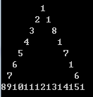
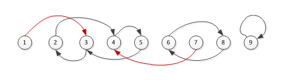

[TOC]


# [题目链接](https://www.lanqiao.cn/courses/2786/learning/?id=67149)

# C组真题

##  题目结构

|  题目  |   类型   | 分值 |
| :----: | :------: | :--: |
| 第一题 | 结果填空 | 5分  |
| 第二题 | 结果填空 | 9分  |
| 第三题 | 结果填空 | 13分 |
| 第四题 | 结果填空 | 17分 |
| 第五题 | 代码填空 | 7分  |
| 第六题 | 代码填空 | 11分 |
| 第七题 | 程序设计 | 19分 |
| 第八题 | 程序设计 | 21分 |
| 第九题 | 程序设计 | 23分 |
| 第十题 | 程序设计 | 25分 |

****

## 第一题 哪天返回

* **问题重现**

  >小明被不明势力劫持。后莫名其妙被扔到x星站再无问津。
  >小明得知每天都有飞船飞往地球，但需要108元的船票，而他却身无分文。
  >他决定在x星战打工。好心的老板答应包食宿，第1天给他1元钱。
  >并且，以后的每一天都比前一天多2元钱，直到他有足够的钱买票。
  >请计算一下，小明在第几天就能凑够108元，返回地球。 
  >
  >**输出**
  >
  >输出一个整数表示答案

* **解题思路**

  就是一个等差数列，利用公式求解可得。

* **代码**

* **答案**

  $11$

****

## 第二题 猴子分香蕉

* **问题重现**

  >5只猴子是好朋友，在海边的椰子树上睡着了。这期间，有商船把一大堆香蕉忘记在沙滩上离去。
  >第1只猴子醒来，把香蕉均分成5堆，还剩下1个，就吃掉并把自己的一份藏起来继续睡觉。
  >第2只猴子醒来，重新把香蕉均分成5堆，还剩下2个，就吃掉并把自己的一份藏起来继续睡觉。
  >第3只猴子醒来，重新把香蕉均分成5堆，还剩下3个，就吃掉并把自己的一份藏起来继续睡觉。
  >第4只猴子醒来，重新把香蕉均分成5堆，还剩下4个，就吃掉并把自己的一份藏起来继续睡觉。
  >第5只猴子醒来，重新把香蕉均分成5堆，哈哈，正好不剩！
  >请计算一开始最少有多少个香蕉。
  >
  >**输入**
  >
  >无
  >
  >**输出**
  >
  >输出一个整数表示答案

* **解题思路**

  一定要注意均分这个点，说明是可以整除的，我们只要枚举判断即可。

* **代码**

* **答案**

  $3141$

****

## 第五题 书号验证

* **问题重现**

  >2004年起，国际ISBN中心出版了《13位国际标准书号指南》。
  >
  >原有10位书号前加978作为商品分类标识；校验规则也改变。
  >
  >校验位的加权算法与10位ISBN的算法不同，具体算法是：
  >
  >1、 用1分别乘ISBN的前12位中的奇数位（从左边开始数起），用3乘以偶数位，乘积之和以10为模，
  >
  >2、10与模值的差值再对10取模（即取个位的数字）即可得到校验位的值，其值范围应该为0~9。
  >
  >下面的程序实现了该算法，请仔细阅读源码，填写缺失的部分。
  >
  >```c++
  >// 验证成功返回 1，否则返回 0 
  >int f(const char* s)
  >{
  >	int k=1;
  >	int sum = 0;
  >	int i; 
  >	for(i=0; s[i]!='\0'; i++){
  >		char c = s[i];
  >		if(c=='-' || c==' ') continue;
  >		sum += _________________________________________ ;  //填空
  >		k++;
  >		if(k>12) break; 
  >	}
  >	
  >	while(s[i]!='\0') i++;
  >	
  >	return (s[i-1]-'0') == (10-sum % 10)%10;
  >}
  >
  >int main()
  >{
  >	printf("%d\n",f("978-7-301-04815-3"));
  >	printf("%d\n",f("978-7-115-38821-6"));	
  >	return 0;
  >}
  >```

* **解题思路**

  横线上所需填的即是我们需要判断是奇数位还是偶数位，由于只有一行，所以用`?:`条件表达式语句即可。

* **答案**

  `(c-'0')*(k%2?1:3)`

****

## 第六题 稍小分数

* **问题重现**

  >回到小学----
  >
  >真分数：分子小于分母的分数
  >
  >既约分数：分子分母互质，也就是说最大公约数是1
  >
  >x星球数学城的入口验证方式是：
  >
  >屏幕上显示一个真分数，需要你快速地找到一个比它小的既约分数，要求这个分数越大越好。
  >同时限定你的这个分数的分母不能超过100。
  >
  >如下代码很暴力地解决了这个问题，请仔细分析，并填写划线部分缺失的代码。
  >
  >```c++
  >int gcd(int a, int b)
  >{
  >	if(b==0) return a;
  >	return gcd(b, a%b);	
  >}
  >int main()
  >{
  >	// 这是屏幕上显示的那个分数 a/b
  >	int a = 7;
  >	int b = 13;
  >	
  >	int m,n;
  >	int max_a = 0;
  >	int max_b = 1; 
  >	
  >	for(n=100; n>1; n--){
  >		for(m=n-1; m>=1; m--){
  >			if(m*b<a*n && gcd(m,n)==1){
  >				if( __________________________________ ){  //填空
  >					max_a = m;
  >					max_b = n;
  >					break;
  >				}
  >			}
  >		}
  >	}
  >	
  >	printf("%d/%d\n", max_a, max_b);	
  >	return 0;
  >}
  >
  >```

* **解题思路**

  由题意知此`if`判断更新最大值，所以我们需要判断是否符合条件，由于都是整型数据且上一个`if`其实已经提示了，将分数之间的比较转化即$a/b>c/d\equiv a*d>c/b$。

* **答案**

  `m*max_b>n*max_a`

****

##  第七题 次数差

* **问题重现**

  >x星球有26只球队，分别用a~z的26个字母代表。他们总是不停地比赛。
  >在某一赛段，哪个球队获胜了，就记录下代表它的字母，这样就形成一个长长的串。
  >国王总是询问：获胜次数最多的和获胜次数最少的有多大差距？
  >
  >输入
  >
  >输入存在多组数据，对于每组数据：
  >输入一行包含一个串，表示球队获胜情况（保证串的长度<1000）
  >
  >输出
  >
  >对于每组数据：输出一个数字，表示出现次数最多的字母比出现次数最少的字母多了多少次。
  >
  >样例输入
  >
  >```c++
  >abaabcaa
  >bbccccddaaaacccc
  >```
  >
  >样例输出 
  >
  >```c++
  >4
  >6
  >```

* **解题思路**

  利用map容器记录，最后遍历记录最大值和最小值即可得出答案。

* **代码**

****

## 第八题 等腰三角形

* **问题重现**

  > 本题目要求你在控制台输出一个由数字组成的等腰三角形。
  > 具体的步骤是：
  >
  > 1. 先用1,2,3，...的自然数拼一个足够长的串
  > 2. 用这个串填充三角形的三条边。从上方顶点开始，逆时针填充。比如，当三角形高度是8时 ：
  >    
  >
  > **输入**
  >
  > 输入存在多组数据，对于每组数据：
  > 输入一行包含一个正整数n(3<n<300),表示三角形的高度
  >
  > **输出**
  >
  > 对于每组测试数据输出用数字填充的等腰三角形。
  > 为了便于测评，我们要求空格一律用"."代替。
  >
  > **样例输入**
  >
  > ```c++
  > 5
  > 10
  > ```
  >
  > **样例输出**
  >
  > ```c++
  > ....1
  > ...2.1
  > ..3...2
  > .4.....1
  > 567891011
  > .........1
  > ........2.2
  > .......3...2
  > ......4.....2
  > .....5.......1
  > ....6.........2
  > ...7...........0
  > ..8.............2
  > .9...............9
  > 1011121314151617181
  > ```

* **解题思路**

  首先我们要做的就是将这些整数连成一个串，然后根据坐标绘制即可。注意坐标的变化。

* **代码**

****

## 第九题 小朋友崇拜圈

* **问题重现**

  >班里N个小朋友，每个人都有自己最崇拜的一个小朋友（也可以是自己）。
  >在一个游戏中，需要小朋友坐一个圈，
  >每个小朋友都有自己最崇拜的小朋友在他的右手边。
  >求满足条件的圈最大多少人？
  >小朋友编号为1,2,3,...N
  >
  >**输入**
  >
  >输入第一行，一个整数N（3<N<100000）
  >接下来一行N个整数，由空格分开。表示每位小朋友崇拜的小朋友的编号。
  >
  >**输出**
  >
  >输出一个整数，表示满足条件的最大圈的人数。
  >
  >**样例输入**
  >
  >```c++
  >9
  >3 4 2 5 3 8 4 6 9
  >```
  >
  >**样例输出** 
  >
  >```c++
  >4
  >```
  >
  >**提示**
  >
  >如图所示，崇拜关系用箭头表示，红色表示不在圈中。
  >显然，最大圈是[2 4 5 3] 构成的圈
  >

* **解题思路**

  我们可以用一个数组`friends`来表示，其中`friends[i]`表示第$i$个小朋友崇拜的人。那么，我们就可以用$dfs$去搜索环的长度了，要注意的就是搜索完之后标记的清除。

* **代码**

****

## 第十题 耐摔指数

* **问题重现**

  >x星球的居民脾气不太好，但好在他们生气的时候唯一的异常举动是：摔手机。
  >各大厂商也就纷纷推出各种耐摔型手机。
  >x星球的质监局规定了手机必须经过耐摔测试，并且评定出一个耐摔指数来，之后才允许上市流通。
  >x星球有很多高耸入云的高塔，刚好可以用来做耐摔测试。
  >塔的每一层高度都是一样的，与地球上稍有不同的是，他们的第一层不是地面，而是相当于我们的2楼。
  >如果手机从第7层扔下去没摔坏，但第8层摔坏了，则手机耐摔指数=7。
  >特别地，如果手机从第1层扔下去就坏了，则耐摔指数=0。
  >如果到了塔的最高层第n层扔没摔坏，则耐摔指数=n
  >为了减少测试次数，从每个厂家抽样3部手机参加测试。
  >如果已知了测试塔的高度，并且采用最佳策略，在最坏的运气下最多需要测试多少次才能确定手机的耐摔指数呢？
  >
  >**输入**
  >
  >输入存在多组测试数据，每组测试数据输入一个整数n（3<n<10000）,表示测试塔的高度。
  >
  >**输出**
  >
  >对于每组测试数据，输出一个整数，表示最多测试多少次。
  >
  >**样例输入**
  >
  >```c++
  >3
  >7
  >```
  >
  >**样例输出**
  >
  >```c++
  >2
  >3
  >```
  >
  >**提示**
  >
  >1. 手机a从2楼扔下去，坏了，就把b手机从1楼扔；否则a手机继续3层扔下
  >2. a手机从4层扔，坏了，则下面有3层，b,c 两部手机2次足可以测出指数；
  >
  >   若是没坏，手机充足，上面5,6,7 三层2次也容易测出。

* **解题思路**

  我们试想，如果只有一个手机，那么直接暴力枚举就是答案了。可是现在有三个手机。二分？可以做吗？我们发现，对于二分法，如果每次枚举的点都碎了，那就无法得到答案了，显然不行，对于有无限个手机的时候这个才是最佳决策。那么这道题我们该怎么做呢？其实这道题蕴含着好多决策点，我们测一次楼层的时候即是一个状态，而且这状态显然是相互转移的，所以动态规划才是解决这道问题的关键。我们用$dp[i][j]$表示现在还有$i$部手机且待测楼层有$j$层时，最坏运气下的最少的测试次数。那么我们测试$k(k\in [1,j]$层时则有两种情况：

  

  1. ==如果当前测的手机坏了，那么手机数量减一，并去下一层测试，此时待测楼层为$k-1$。==

  2. ==如果当前测的手机没坏，那么就去上一层测试，此时$j-k$。==

  

   我们想要的状态为$dp[3][n]$，我们已知的状态即是只有一个手机的时候，我们运气最差只能从$1$测到$j$，这样进行状态转移即可。

* **代码**

