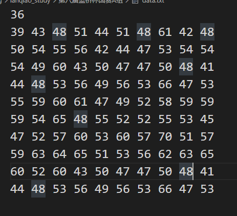

# A组真题

##  题目结构

|  题目  |   类型   | 分值 |
| :----: | :------: | :--: |
| 第一题 | 结果填空 | 17分 |
| 第二题 | 结果填空 | 43分 |
| 第三题 | 代码填空 | 25分 |
| 第四题 | 程序设计 | 41分 |
| 第五题 | 程序设计 | 75分 |
| 第六题 | 程序设计 | 99分 |

****

## 第一题 平方十位数

* **问题重现**

  >由0~9这10个数字不重复、不遗漏，可以组成很多10位数字。
  >这其中也有很多恰好是平方数（是某个数的平方）。
  >比如：1026753849，就是其中最小的一个平方数。
  >请你找出其中最大的一个平方数是多少？
  >
  >输出
  >
  >输出一个整数表示答案

* **解题思路**

  对于这种不能剪枝且数据量较小的直接暴力全排列。

* **代码**

* **答案**

  $9814072356$。

****

## 第二题 生命游戏

* **问题重现**

  >康威生命游戏是英国数学家约翰·何顿·康威在1970年发明的细胞自动机。 
  >这个游戏在一个无限大的2D网格上进行。初始时，每个小方格中居住着一个活着或死了的细胞。
  >下一时刻每个细胞的状态都由它周围八个格子的细胞状态决定。
  >具体来说：
  >
  >1.当前细胞为存活状态时，当周围低于2个（不包含2个）存活细胞时， 该细胞变成死亡状态。（模拟生命数量稀少）
  >
  >2.当前细胞为存活状态时，当周围有2个或3个存活细胞时， 该细胞保持原样。
  >
  >3.当前细胞为存活状态时，当周围有3个以上的存活细胞时，该细胞变成死亡状态。（模拟生命数量过多）
  >
  >4.当前细胞为死亡状态时，当周围有3个存活细胞时，该细胞变成存活状态。 （模拟繁殖）
  >
  >```c++
  >例如假设初始是:(X代表活细胞，.代表死细胞)
  >.....
  >.....
  >.XXX.
  >.....
  >下一代会变为:
  >.....
  >..X..
  >..X..
  >..X..
  >.....
  >康威生命游戏中会出现一些有趣的模式。例如稳定不变的模式：
  >....
  >.XX.
  >.XX.
  >....
  >还有会循环的模式：
  >......      ......       ......
  >.XX...      .XX...       .XX...
  >.XX...      .X....       .XX...
  >...XX.   -> ....X.  ->   ...XX.
  >...XX.      ...XX.       ...XX.
  >......      ......       ......
  >本题中我们要讨论的是一个非常特殊的模式，被称作"Gosper glider gun"：
  >......................................
  >.........................X............
  >.......................X.X............
  >.............XX......XX............XX.
  >............X...X....XX............XX.
  >.XX........X.....X...XX...............
  >.XX........X...X.XX....X.X............
  >...........X.....X.......X............
  >............X...X.....................
  >.............XX.......................
  >......................................
  >假设以上初始状态是第0代，请问第1000000000(十亿)代一共有多少活着的细胞？
  >```
  >
  >注意：我们假定细胞机在无限的2D网格上推演，并非只有题目中画出的那点空间。
  >当然，对于遥远的位置，其初始状态一概为死细胞。
  >
  >输出
  >
  >输出一个整数表示答案

* **解题思路**

  ~~==这道题说实话在赛场上应该是做不出来的。==​~~其实处理这个演变过程特别简单，对每一个点模拟判断即可，而题目要求的是$10$亿代，我们肯定不是直接模拟$10$亿次，这时间空间根本不够，所以这种题应该就是有规律的，我们可以利用将$100$以内的数据读入文本中，如下：

  

  然后利用$Excel$分析，很难发现，其实每隔$30$代细胞数就增加$5$（除了初始的前$30$代）。==注意，由于这里地图没有扩大，导致后面的数据不正确，如果将地图放大，是满足这个规律的==。

  那么我们实际上就是输出第$n%30$代$+$$n/30\times 5$。

* **代码**

* **答案**

  $166666713$。

## 第三题 表达式计算

* **问题重现**

  >虽然我们学了许久的程序设计，但对于简单的四则混合运算式，
  >
  >如果让我们完全白手起家地编程来解析，还是有点棘手。
  >
  >这里，我们简化一下问题，假设只有加法和乘法，并且没有括号来改变优先级。
  >
  >再假设参加运算的都是正整数。
  >
  >在这么多的限制条件下，表达式的解析似乎简单了许多。
  >
  >下面的代码解决了这个问题。请仔细阅读源码，并填写划线部分缺少的代码。
  >
  >```c++
  >#include <stdio.h>
  >
  >int f3(const char* s, int begin, int end)
  >{
  >    int sum = 0;
  >    int i;
  >    for(i=begin; i<end; i++){
  >        if(s[i]==' ') continue;
  >        sum = sum * 10 + (s[i]-'0');
  >    }
  >    return sum;
  >}
  >
  >int f2(const char* s, int begin, int end)
  >{
  >    int p = begin;
  >    int pro = 1;
  >    while(1){
  >        int p0 = p;
  >        while(p!=end && s[p]!='*') p++;
  >        pro *= _______________________________;  //填空
  >        if(p==end) break;
  >        p++;
  >    }
  >    printf("f2: pro=%d\n", pro);
  >    return pro;
  >}
  >
  >int f(const char* s)
  >{
  >    int p = 0;
  >    int sum = 0;
  >    while(1){
  >        int p0 = p;
  >        while(s[p]!=0 && s[p]!='+') p++;
  >        sum += f2(s,p0,p);
  >        if(s[p]==0) break;
  >        p++;
  >    }
  >    
  >    return sum;
  >}
  >
  >int main()
  >{
  >    int x = f("12+18+5*4*3+10");
  >    printf("%d\n", x);
  >    return 0;
  >}
  >```
  >
  >注意：只填写划线处缺少的内容，不要填写已有的代码或符号，也不要填写任何解释说明文字等。

* **解题思路**

  不难发现，$f$函数就是实现表达式计算的函数，其中通过$while$循环找到+号，将$+$号之前的数值计算出来。而计算数值则是通过$f2$，对于$f2$首先是判断是否有乘号，也就是说我们需要找到$*$号，然后将$*$号之前的计算出来相乘即可。题中代码思路十分清晰，易得。

* **答案**

## 第四题 填字母游戏

* **问题重现**

  >小明经常玩 LOL 游戏上瘾，一次他想挑战K大师，不料K大师说：
  >“我们先来玩个空格填字母的游戏，要是你不能赢我，就再别玩LOL了”。
  >K大师在纸上画了一行n个格子，要小明和他交替往其中填入字母。
  >并且：
  >\1. 轮到某人填的时候，只能在某个空格中填入L或O
  >\2. 谁先让字母组成了“LOL”的字样，谁获胜。
  >\3. 如果所有格子都填满了，仍无法组成LOL，则平局。
  >小明试验了几次都输了，他很惭愧，希望你能用计算机帮他解开这个谜。
  >
  >输入
  >
  >第一行，数字n（n<10），表示下面有n个初始局面。
  >接下来，n行，每行一个串(长度<20)，表示开始的局面。
  >比如：“******”, 表示有6个空格。
  >“L”,  表示左边是一个字母L，它的右边是4个空格。
  >
  >输出
  >
  >要求输出n个数字，表示对每个局面，如果小明先填，当K大师总是用最强着法的时候，小明的最好结果。
  >1 表示能赢，-1 表示必输，0 表示可以逼平。
  >
  >样例输入
  >
  >```c++
  >4
  >***
  >L**L
  >L**L***L
  >L*****L
  >```
  >
  >样例输出
  >
  >```c++
  >0
  >-1
  >1
  >1
  >```

* **解题思路**

  一道非常好玩的博弈问题。由于局面够小，所以我们可以直接模拟，==那么模拟过程中我们就要清楚一点，每个人都是采取最优策略，即赢$>$平局$>$输，如果能赢绝不平局，如果不能赢就平局，不到万不得已不能输。== 按照这个思想，仔细分析局面即可。代码中已贴详细注释。其中比较重要的一点就是要记忆化局面，即存储好已经计算过的局面，这样才不会超时。

* **代码**

## 第五题 区间移位

* **问题重现**

  >数轴上有n个闭区间：D1,...,Dn。其中区间Di用一对整数[ai, bi]来描述，满足ai< bi。
  >已知这些区间的长度之和至少有10000。
  >所以，通过适当的移动这些区间，你总可以使得他们的“并”覆盖[0, 10000]
  >也就是说[0, 10000]这个区间内的每一个点都落于至少一个区间内。
  >你希望找一个移动方法，使得位移差最大的那个区间的位移量最小。
  >具体来说，假设你将Di移动到[ai+ci, bi+ci]这个位置。你希望使得maxi{|ci|} 最小。
  >
  >输入
  >
  >输入的第一行包含一个整数n，表示区间的数量。
  >接下来有n行，每行2个整数ai, bi，以一个空格分开，表示区间[ai, bi]。
  >保证区间的长度之和至少是10000。
  >$1 <= n <= 10000，0 <= a_i< b_i<= 10000$
  >
  >输出
  >
  >输出一个数字，表示答案。如果答案是整数，只输出整数部分。
  >如果答案不是整数，输出时四舍五入保留一位小数。
  >
  >```c++
  >【样例输入】
  >2
  >10 5010
  >4980 9980
  >
  >【样例输出】
  >20
  >
  >【样例说明】
  >第一个区间往左移动10；第二个区间往右移动20。
  >
  >【样例输入】
  >4
  >0 4000
  >3000 5000
  >5001 8000
  >7000 10000
  >【样例输出】
  >0.5
  >【样例说明】
  >第2个区间往右移0.5；第3个区间往左移0.5即可。
  >```

* **解题思路**

  对于这种答案处于我们已知的范围类的题，我们是可以利用二分法来枚举这个答案的，我想对于二分法处理起来很简单，我们需要先将区间$\times$2，这这样能保证我们枚举的时候不会精度丢失。关键就是判断我们枚举的答案是否可行。这是最难也是最重要的一点。==首先，我们需要对区间进行处理，即对它们进行排序，为了处理方便，我们统一以右区间端点作为主衡量标准，左区间端点副衡量标准，这样是因为我们处理是从左到右的。== 我们确定一个变量$last$来维护当前所填的区间的最右端点（初始为$0$）。那么满足条件的标准就是其值大于$20000$（因为区间长度被我们放大了）。然后在维护这个变量的时候就是不断往$last$处插入区间。已贴详细注释。

* **代码**

## 第六题 数组操作

* **问题重现**

  >给出一个长度为 n 的数组 {A}，由 1 到 n 标号 ， 你需要维护 m 个操作。
  >操作分为三种，输入格式为：
  >1 L R d，将数组中下标 L 到 R 的位置都加上 d，即对于 L<=i<=R，执行A[i]=A[i]+d。
  >2 L1 R1 L2 R2，将数组中下标为 L1 到 R1 的位置，赋值成 L2 到 R2 的值，保证 R1-L1=R2-L2。 
  >换句话说先对 0<=i<=R2-L2 执行 B[i]=A[L2+i]，再对 0<=i<=R1-L1 执行 A[L1+i]=B[i]，其中 {B} 为一个临时数组。
  >3 L R，求数组中下标 L 到 R 的位置的和，即求出 ∑Ai(i=L到R)。
  >
  >输入
  >
  >第一行一个整数 Case，表示测试点编号，其中 Case=0 表示该点为样例。
  >第二行包含两个整数 n,m。保证 1<=n,m<=10^5。
  >第三行包含 n 个整数 A_i，表示这个数组的初值。保证 0<=A_i<=10^5。
  >接下来 m 每行描述一个操作，格式如问题描述所示。
  >对于操作中提到每个数，满足 0<=d<=10^5，1<=L<=R<=n，1<=L1<=R1<=n，1<=L2<=R2<=n，R1-L1=R2-L2。
  >
  >输出
  >
  >对于每次 3 操作输出一行一个数，表示求和的结果。
  >
  >样例输入
  >
  >```c++
  >0
  >5 6
  >1 2 3 4 5
  >2 1 3 3 5
  >3 3 5
  >1 2 4 2
  >3 3 5
  >2 1 3 3 5
  >3 1 5
  >```
  >
  >样例输出
  >
  >```c++
  >14
  >18
  >29
  >```

* **解题思路**

  这道题就是利用线段树来处理的，题解暂时搁置，待补。

* **代码**