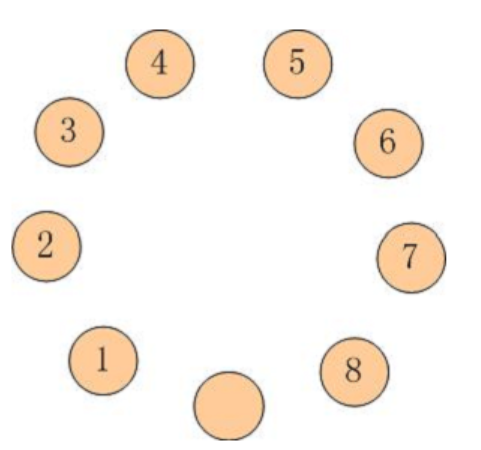
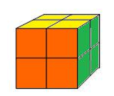
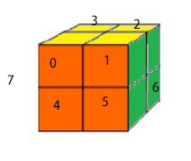
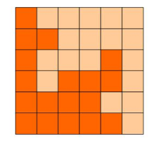
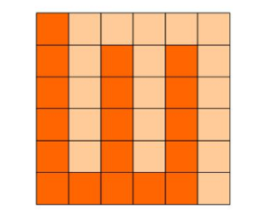
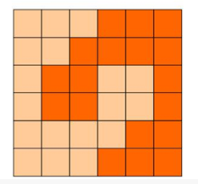
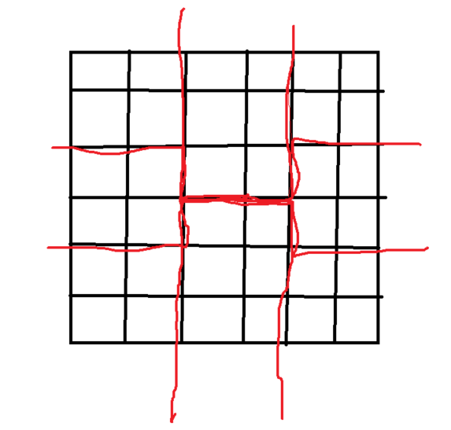
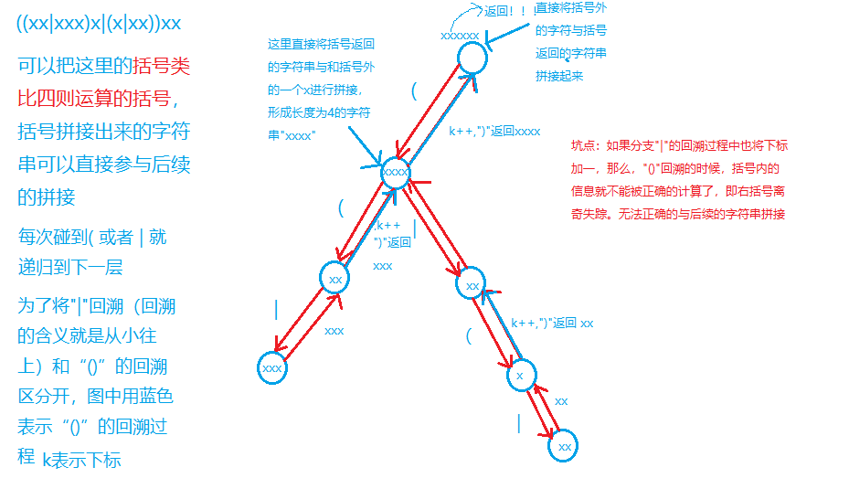

# [题目链接](https://www.lanqiao.cn/courses/2786/learning/?id=67149)

# A组真题

##  题目结构

|  题目  |   类型   | 分值 |
| :----: | :------: | :--: |
| 第一题 | 结果填空 | 5分  |
| 第二题 | 结果填空 | 11分 |
| 第三题 | 结果填空 | 13分 |
| 第四题 | 结果填空 | 17分 |
| 第五题 | 代码填空 | 7分  |
| 第六题 | 代码填空 | 9分  |
| 第七题 | 程序设计 | 19分 |
| 第八题 | 程序设计 | 21分 |
| 第九题 | 程序设计 | 23分 |
| 第十题 | 程序设计 | 25分 |

****

## 第一题 迷宫

* **问题重现**

  >X星球的一处迷宫游乐场建在某个小山坡上。
  >它是由10x10相互连通的小房间组成的。
  >
  >房间的地板上写着一个很大的字母。
  >我们假设玩家是面朝上坡的方向站立，则：
  >L表示走到左边的房间，
  >R表示走到右边的房间，
  >U表示走到上坡方向的房间，
  >D表示走到下坡方向的房间。
  >
  >X星球的居民有点懒，不愿意费力思考。
  >他们更喜欢玩运气类的游戏。这个游戏也是如此！
  >
  >开始的时候，直升机把100名玩家放入一个个小房间内。
  >玩家一定要按照地上的字母移动。
  >
  >迷宫地图如下：
  >
  >UDDLUULRUL
  >UURLLLRRRU
  >RRUURLDLRD
  >RUDDDDUUUU
  >URUDLLRRUU
  >DURLRLDLRL
  >ULLURLLRDU
  >RDLULLRDDD
  >UUDDUDUDLL
  >ULRDLUURRR
  >
  >请你计算一下，最后，有多少玩家会走出迷宫?
  >而不是在里边兜圈子。
  >
  >**注意**
  >
  >请提交该整数，表示走出迷宫的玩家数目，不要填写任何多余的内容。
  >
  >如果你还没明白游戏规则，可以参看一个简化的4x4迷宫的解说图：
  >
  >

* **解题思路**
  ==对迷宫中的每一个点都跑一遍$dfs$判断是否能够到达边界== ，注意对于每一个点在开始搜索之前都需要情况状态，并在搜索过程中标记访问过的点避免死循环。

* **代码**、

* **答案**

  $31$

****

## 第二题 跳蚱蜢

* **问题重现**

  >如图所示：
  >
  >
  >
  >有9只盘子，排成1个圆圈。
  >其中8只盘子内装着8只蚱蜢，有一个是空盘。
  >我们把这些蚱蜢顺时针编号为 1~8
  >
  >每只蚱蜢都可以跳到相邻的空盘中，
  >也可以再用点力，越过一个相邻的蚱蜢跳到空盘中。
  >
  >请你计算一下，如果要使得蚱蜢们的队形改为按照逆时针排列，
  >并且保持空盘的位置不变（也就是1-8换位，2-7换位,…），至少要经过多少次跳跃？
  >
  >注意
  >
  >要求提交的是一个整数，请不要填写任何多余内容或说明文字。

* **解题思路**

  对于这道题，==我们需要将空格作为一个动点，它可以进行四种操作，由于我们需要寻找最少的操作次数，所以我们可以利用$bfs$模拟交换。==为了避免状态重复我们可以利用$map$容器来实现，记录已经出现过的地图状态。值得注意的一点就是坐标的处理 ，我们如果坐标大于$8$就需要对$8$取余，而如果小于$0$，则需要加上$9$这样才可以保证逻辑上是环状的。

* **代码**

* **答案**

  $20$。

** **

## 第三题 魔方状态

* **问题重现**

  >二阶魔方就是只有2层的魔方，只由8个小块组成。
  >如图所示：
  >
  >
  >
  >小明很淘气，他只喜欢3种颜色，所有把家里的二阶魔方重新涂了颜色，如下：
  >
  >前面：橙色
  >右面：绿色
  >上面：黄色
  >左面：绿色
  >下面：橙色
  >后面：黄色
  >
  >请你计算一下，这样的魔方被打乱后，一共有多少种不同的状态。
  >
  >如果两个状态经过魔方的整体旋转后，各个面的颜色都一致，则认为是同一状态。
  >
  >注意
  >
  >请提交表示状态数的整数，不要填写任何多余内容或说明文字。

* **解题思路**

  一开始拿到这道题的时候是真的不知道该怎么处理，直到找到一个狠人的博客才把这道题彻彻底底的解决了。[博客链接](https://blog.csdn.net/qq_35222235/article/details/79725363?ops_request_misc=%257B%2522request%255Fid%2522%253A%2522161710898316780255215519%2522%252C%2522scm%2522%253A%252220140713.130102334..%2522%257D&request_id=161710898316780255215519&biz_id=0&utm_medium=distribute.pc_search_result.none-task-blog-2~all~sobaiduend~default-1-79725363.first_rank_v2_pc_rank_v29&utm_term=%E9%AD%94%E6%96%B9%E7%8A%B6%E6%80%81)

   这道题说实话不是一般的难，我们需要将所有的情况都找出，那么只能模拟操作进行判重。==对于魔方而言，只做顶层顺时针U操作，前层顺时针F操作，右层顺时针R操作即可得到所有状态。== 

  为了方便，我们需要进行一些处理，对于二阶魔方上的小块，我们可以对其进行编号，如下：

  

  而每个小块有六个面，我们可以用字符串表示该块的状态。对于看不见的面，我们用黑色来表示（因为我们终究是要表示这些块，加上则更方便进行处理，对于其中的看不见的面我们不会处理到。）则o表示橙色，b表示黑色，g表示绿色，y表示黄色。我们规定小块上的面编号如下：

  

  那么初始状态如下：

  ```c++
  string cube[8]={"oybbgb","oygbbb","bygbby","bybbgy","obbogb","obgobb","bbgoby","bbbogy"};//代表魔方的初始状态。
  ```

  要注意的就是模拟$R,U,F$这三个操作了，我们可以大量利用$swap$函数来进行交换，先对小块上的面进行交换，然后再处理块。这些注意好细节就好处理，同样，为了之后判重整体旋转魔方，所以我们还需要写三个操作进行底层旋转利用判重。

  接下来我们需要处理的就是判重了，对于一个魔方，这是一个二维的字符串，所以我们需要将其降维，将其拼接起来并用$set$容器存储。那么在检查是否出现我们就需要对魔方进行整体旋转了，然后将没有重复的魔方加入$set$中。

  最后，也是一个非常细节的问题，就是我们需要用头尾指针来记录已经出现过的魔方数和当时正在旋转的魔方。这样我们总能将所有的魔方都遍历到，而不至于出现只进行$RUFRUF...$，我们知道这种不过多久就会还原成初始魔方。

  ==结果需要跑挺久的，大概$1$分钟，所以这道题出在这实属有些不合适，虽然这道题~~挺有趣的~~==

* **代码**

* **答案**

  $229878$

****

## 第四题 方格分割

* **问题重现**

  > 6x6的方格，沿着格子的边线剪开成两部分。
  > 要求这两部分的形状完全相同。
  >
  > 如图：
  >
  > 
  >
  > 就是可行的分割法。
  >
  > 试计算：
  > 包括这3种分法在内，一共有多少种不同的分割方法。

* **解题思路**

  这道题已经告诉我们是沿着边线分割了，我们也应该知道，如果对方格进行处理要明显不好做。我们如果要分割后的两部分都相同，那么它们必须是中心点对称的。也就是经过了点$(3,3)$。所以我们可以把这个点当做出发点，那么我们对这个点开始进行$dfs$，在搜索过程中，我们需要对中心对称的点进行标记，为了避免干扰，在当前路径搜索完成之后再将标记还原。那么搜索完成的条件即是到达边界，这样正是将方格分割成了两个完全相等的部分。对于最后的结果，我们需要除以$4$，我们且看下图：

  

  这四条路径分出来的形状是一样的。这是因为正方形是高度对称的，而分割路径则可以放置在竖直两条和水平两条。也就是$4$种情况。

* **代码**

* **答案**

  $509$。

****

## 第五题 字母组串

* **问题重现**

  >由 A,B,C 这3个字母就可以组成许多串。
  >比如：“A”,“AB”,“ABC”,“ABA”,“AACBB” …
  >
  >现在，小明正在思考一个问题：
  >如果每个字母的个数有限定，能组成多少个已知长度的串呢？
  >
  >他请好朋友来帮忙，很快得到了代码，
  >解决方案超级简单，然而最重要的部分却语焉不详。
  >
  >请仔细分析源码，填写划线部分缺少的内容。
  >
  >```c++
  >#include <stdio.h>
  >
  >// a个A，b个B，c个C 字母，能组成多少个不同的长度为n的串。
  >int f(int a, int b, int c, int n)
  >{
  >  if (a < 0 || b < 0 || c < 0) return 0;
  >  if (n == 0) return 1;
  >
  >  return ______________________________________;  // 填空
  >}
  >
  >int main()
  >{
  >  printf("%d\n", f(1, 1, 1, 2));
  >  printf("%d\n", f(1, 2, 3, 3));
  >  return 0;
  >}
  >
  >```

* **解题思路**

  一道非常简单的代码填空问题。因为这几个参数的含义题目已经告诉我们了，即：在当前状态还剩下$n$个位置没有填充，还有$a$个$A$，$b$个$B$，$c$个$C$可以用。我们发现，这实际上就是一个递归回溯，将大问题转换为小问题，而结束条件即是当$n$已经为$0$或者$A,B,C$的数量不够用了。那么我们每次可以选择用$a$或$b$或$c$，则答案已经清晰明了了。

* **答案**

****

## 第六题 最大公共子串

* **问题重现**

  >最大公共子串长度问题就是：
  >求两个串的所有子串中能够匹配上的最大长度是多少。
  >
  >比如：“abcdkkk” 和 “baabcdadabc”，
  >可以找到的最长的公共子串是"abcd",所以最大公共子串长度为4。
  >
  >下面的程序是采用矩阵法进行求解的，这对串的规模不大的情况还是比较有效的解法。
  >
  >请分析该解法的思路，并补全划线部分缺失的代码。
  >
  >```c++
  >#include <stdio.h>
  >#include <string.h>
  >
  >#define N 256
  >int f(const char* s1, const char* s2)
  >{
  >	int a[N][N];
  >	int len1 = strlen(s1);
  >	int len2 = strlen(s2);
  >	int i,j;
  >	
  >	memset(a,0,sizeof(int)*N*N);
  >	int max = 0;
  >	for(i=1; i<=len1; i++){
  >		for(j=1; j<=len2; j++){
  >			if(s1[i-1]==s2[j-1]) {
  >				a[i][j] = __________________________;  //填空
  >				if(a[i][j] > max) max = a[i][j];
  >			}
  >		}
  >	}
  >	
  >	return max;
  >}
  >
  >int main()
  >{
  >	printf("%d\n", f("abcdkkk", "baabcdadabc"));
  >	return 0;
  >}
  >
  >```

* **解题思路** 

  基础$dp$问题。这里进行状态转移。即$dp[i][j]=dp[i-1][j-1]+1$。

* **答案**

****

## 第七题 正则问题

* **问题重现**

  >考虑一种简单的正则表达式：
  >只由 x ( ) | 组成的正则表达式。
  >小明想求出这个正则表达式能接受的最长字符串的长度。
  >
  >例如 ((xx|xxx)x|(x|xx))xx 能接受的最长字符串是： xxxxxx，长度是6。
  >
  >**输入格式**
  >
  >一个由x()|组成的正则表达式。输入长度不超过100，保证合法。
  >
  >**输出格式**
  >
  >这个正则表达式能接受的最长字符串的长度。
  >
  >**样例输入**
  >
  >((xx|xxx)x|(x|xx))xx
  >
  >**样例输出**
  >
  >6
  >
  >**资源约定**
  >
  >峰值内存消耗（含虚拟机） < 256M
  >CPU消耗 < 1000ms
  >
  >**注意**
  >
  >请严格按要求输出，不要画蛇添足地打印类似：“请您输入…” 的多余内容。
  >
  >main函数需要返回0;
  >只使用ANSI C/ANSI C++ 标准;
  >不要调用依赖于编译环境或操作系统的特殊函数。
  >所有依赖的函数必须明确地在源文件中 #include
  >不能通过工程设置而省略常用头文件。
  >提交程序时，注意选择所期望的语言类型和编译器类型。

* **解题思路**

  我们首先要知道对于$()$符号是优先计算的，而对于$|$符号则是取左右两边的其中一个。也就是说当我们碰到$($的时候，我们就需要开始遍历新的路统计'x'的数量，然后碰到$)$的时候则需要返回原来的路径，并将其值累加。同样对于$|$符号也是需要开启一条新路，结束的标志则是遍历完成或者是遇到了$)$，在遍历之前和遍历之后返回的数之间去一个最大值。清楚了这个，我们就可以进行$dfs$模拟了，我们从字符串开始进行。这里引用一张大佬画的递归搜索树，原博文地址为：[博客链接](https://www.acwing.com/solution/content/8812/)。

  

* **代码**

****

## 第八题 包子凑数

* **问题重现**

  >小明几乎每天早晨都会在一家包子铺吃早餐。他发现这家包子铺有N种蒸笼，其中第i种蒸笼恰好能放Ai个包子。每种蒸笼都有非常多笼，可以认为是无限笼。
  >
  >每当有顾客想买X个包子，卖包子的大叔就会迅速选出若干笼包子来，使得这若干笼中恰好一共有X个包子。比如一共有3种蒸笼，分别能放3、4和5个包子。当顾客想买11个包子时，大叔就会选2笼3个的再加1笼5个的（也可能选出1笼3个的再加2笼4个的）。
  >
  >当然有时包子大叔无论如何也凑不出顾客想买的数量。比如一共有3种蒸笼，分别能放4、5和6个包子。而顾客想买7个包子时，大叔就凑不出来了。
  >
  >小明想知道一共有多少种数目是包子大叔凑不出来的。
  >
  >**输入格式**
  >
  >第一行包含一个整数N。(1 <= N <= 100)
  >以下N行每行包含一个整数Ai。(1 <= Ai <= 100)
  >
  >**输出格式**
  >
  >一个整数代表答案。如果凑不出的数目有无限多个，输出INF。
  >
  >样例输入
  >
  >2
  >4
  >5
  >
  >**样例输出**
  >
  >6
  >
  >**样例输入**
  >
  >2
  >4
  >6
  >
  >**样例输出**
  >
  >INF
  >
  >**样例解释**
  >
  >对于样例1，凑不出的数目包括：1, 2, 3, 6, 7, 11。
  >对于样例2，所有奇数都凑不出来，所以有无限多个。
  >
  >资源约定
  >
  >峰值内存消耗（含虚拟机） < 256M
  >CPU消耗 < 1000ms
  >
  >**注意**
  >
  >请严格按要求输出，不要画蛇添足地打印类似：“请您输入…” 的多余内容。
  >
  >main函数需要返回0;
  >只使用ANSI C/ANSI C++ 标准;
  >不要调用依赖于编译环境或操作系统的特殊函数。
  >所有依赖的函数必须明确地在源文件中 #include
  >不能通过工程设置而省略常用头文件。
  >提交程序时，注意选择所期望的语言类型和编译器类型。

* **解题思路**

  这道题实际上就是先利用贝祖定理判断再利用动态规划解决。我们首先要知道贝祖定理：任意两个数的组合必定是他们$gcd$的倍数，同样可以推广到更多数：如果这些数的$gcd$是$d$，那么他们的组合是$d$的倍数，如果$d$不是$1$，那么必然有无限个数无法被组合出来。这里指路一篇$blog$学习贝祖定理。[博客链接](https://blog.csdn.net/hzf0701/article/details/115307644?spm=1001.2014.3001.5501)。那么我们判断是否有无数解，只需要判断它们的$gcd$是否为$1$即可。那么对于为$1$的情况，即其中的所有数都互质，而我们知道，两个互质数$a,b$最大不能表示的为：$(a-1)(b-1)-1$，也就是说我们上界只需要取最大的两个互质数乘积，我们可以选择$10000$作为上界。

  接下来，我们来定义状态，对于$dp[i][j]$，我们表示已经用了$i$个笼子，且需要$j$个包子能否被凑出来。则我们可以根据在取第$i$个笼子的时候来判断第$i$个物品取了多少件。若有一件是可以被凑出的，那么则成立。也就是说。$dp[i][j]=dp[i-1][j]||dp[i][j-w[i]]||dp[i][j-2*w[i]]........$我们检索即可。最后我们累加在$10000$以内不能凑出来的数。

* **代码**

****

## 第九题 分巧克力

* **问题重现**

  >儿童节那天有K位小朋友到小明家做客。小明拿出了珍藏的巧克力招待小朋友们。
  >小明一共有N块巧克力，其中第i块是Hi x Wi的方格组成的长方形。
  >
  >为了公平起见，小明需要从这 N 块巧克力中切出K块巧克力分给小朋友们。切出的巧克力需要满足：
  >
  >形状是正方形，边长是整数
  >大小相同
  >例如一块6x5的巧克力可以切出6块2x2的巧克力或者2块3x3的巧克力。
  >
  >当然小朋友们都希望得到的巧克力尽可能大，你能帮小明计算出最大的边长是多少么？
  >
  >输入格式
  >
  >第一行包含两个整数N和K。(1 <= N, K <= 100000)
  >以下N行每行包含两个整数Hi和Wi。(1 <= Hi, Wi <= 100000)
  >输入保证每位小朋友至少能获得一块1x1的巧克力。
  >
  >输出格式
  >
  >输出切出的正方形巧克力最大可能的边长。
  >
  >样例输入
  >
  >2 10
  >6 5
  >5 6
  >
  >样例输出
  >
  >2
  >
  >资源约定
  >
  >峰值内存消耗（含虚拟机） < 256M
  >CPU消耗 < 1000ms
  >
  >注意
  >
  >请严格按要求输出，不要画蛇添足地打印类似：“请您输入…” 的多余内容。
  >
  >main函数需要返回0;
  >只使用ANSI C/ANSI C++ 标准;
  >不要调用依赖于编译环境或操作系统的特殊函数。
  >所有依赖的函数必须明确地在源文件中 #include
  >不能通过工程设置而省略常用头文件。
  >提交程序时，注意选择所期望的语言类型和编译器类型。

* **解题思路**

  由于结果一定是在$1$~$100000$的，所以我们可以枚举这切出来的巧克力边长，这里利用二分法。简单易得。

* **代码**

## 第十题 油漆面积

* **问题重现**

  >X星球的一批考古机器人正在一片废墟上考古。
  >该区域的地面坚硬如石、平整如镜。
  >管理人员为方便，建立了标准的直角坐标系。
  >
  >每个机器人都各有特长、身怀绝技。它们感兴趣的内容也不相同。
  >经过各种测量，每个机器人都会报告一个或多个矩形区域，作为优先考古的区域。
  >
  >矩形的表示格式为(x1,y1,x2,y2)，代表矩形的两个对角点坐标。
  >
  >为了醒目，总部要求对所有机器人选中的矩形区域涂黄色油漆。
  >小明并不需要当油漆工，只是他需要计算一下，一共要耗费多少油漆。
  >
  >其实这也不难，只要算出所有矩形覆盖的区域一共有多大面积就可以了。
  >注意，各个矩形间可能重叠。
  >
  >本题的输入为若干矩形，要求输出其覆盖的总面积。
  >
  >输入格式
  >
  >第一行，一个整数n，表示有多少个矩形(1<=n<10000)
  >接下来的n行，每行有4个整数x1 y1 x2 y2，空格分开，表示矩形的两个对角顶点坐标。
  >(0<= x1,y1,x2,y2 <=10000)
  >
  >输出格式
  >
  >一行一个整数，表示矩形覆盖的总面积。
  >
  >样例输入
  >
  >3
  >1 5 10 10
  >3 1 20 20
  >2 7 15 17
  >
  >样例输出
  >
  >340
  >
  >样例输入
  >
  >3
  >5 2 10 6
  >2 7 12 10
  >8 1 15 15
  >
  >样例输出
  >
  >128
  >
  >资源约定
  >
  >峰值内存消耗（含虚拟机） < 256M
  >CPU消耗 < 2000ms
  >
  >注意
  >
  >请严格按要求输出，不要画蛇添足地打印类似：“请您输入…” 的多余内容。
  >
  >main函数需要返回0;
  >只使用ANSI C/ANSI C++ 标准;
  >不要调用依赖于编译环境或操作系统的特殊函数。
  >所有依赖的函数必须明确地在源文件中 #include
  >不能通过工程设置而省略常用头文件。
  >提交程序时，注意选择所期望的语言类型和编译器类型。

* **解题思路**

  这道题直接暴力是容易想到的，我们以左下角的点代表了一个单位正方形，那么对于给定的矩形，我们只要将其内部的点置为真即可。最后遍历统计所有的点。这种方法只能水一点点的分，真正的解法应该是扫描线算法，这个算法暂时不会，之后再补，先贴大佬代码。

* **暴力代码**

* **扫描线算法代码**

  