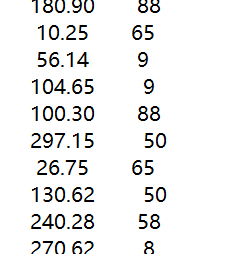
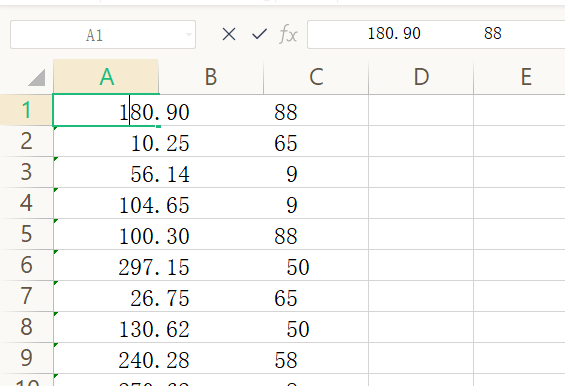
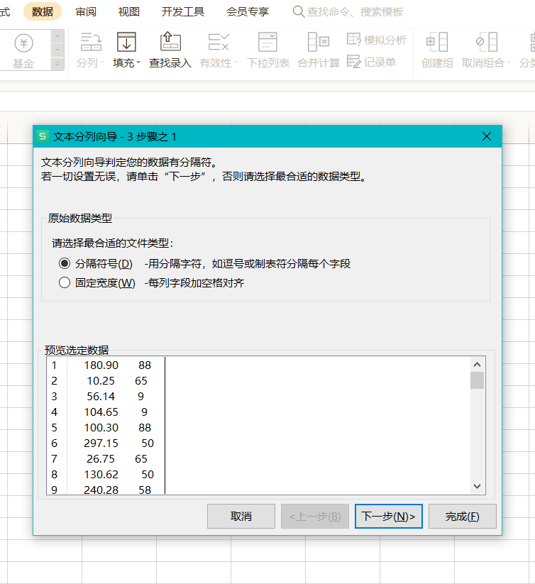
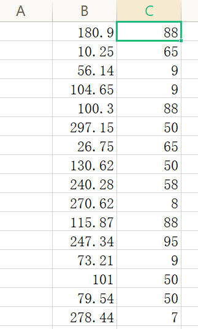
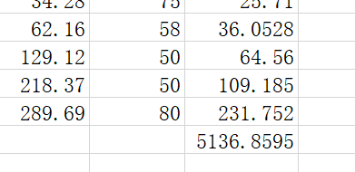

# B组真题

##  题目结构

|  题目  |   类型   | 分值 |
| :----: | :------: | :--: |
| 第一题 | 结果填空 | 5分  |
| 第二题 | 结果填空 | 7分  |
| 第三题 | 结果填空 | 13分 |
| 第四题 | 结果填空 | 17分 |
| 第五题 | 代码填空 | 9分  |
| 第六题 | 代码填空 | 11分 |
| 第七题 | 程序设计 | 19分 |
| 第八题 | 程序设计 | 21分 |
| 第九题 | 程序设计 | 23分 |
| 第十题 | 程序设计 | 25分 |

****

## 第一题 购物单

* 问题重现

  >小明刚刚找到工作，老板人很好，只是老板夫人很爱购物。
  >老板忙的时候经常让小明帮忙到商场代为购物。小明很厌烦，但又不好推辞。
  >这不，XX大促销又来了！老板夫人开出了长长的购物单，都是有打折优惠的。
  >小明也有个怪癖，不到万不得已，从不刷卡，直接现金搞定。
  >现在小明很心烦，请你帮他计算一下，需要从取款机上取多少现金，才能搞定这次购物。
  >取款机只能提供100元面额的纸币。小明想尽可能少取些现金，够用就行了。
  >你的任务是计算出，小明最少需要取多少现金。
  >
  >**输入**
  >
  >本题无输入，购物单如下，物品名称被隐藏了。
  >
  >```cpp
  >****     180.90       88折
  >****      10.25       65折
  >****      56.14        9折
  >****     104.65        9折
  >****     100.30       88折
  >****     297.15        半价
  >****      26.75       65折
  >****     130.62        半价
  >****     240.28       58折
  >****     270.62        8折
  >****     115.87       88折
  >****     247.34       95折
  >****      73.21        9折
  >****     101.00        半价
  >****      79.54        半价
  >****     278.44        7折
  >****     199.26        半价
  >****      12.97        9折
  >****     166.30       78折
  >****     125.50       58折
  >****      84.98        9折
  >****     113.35       68折
  >****     166.57        半价
  >****      42.56        9折
  >****      81.90       95折
  >****     131.78        8折
  >****     255.89       78折
  >****     109.17        9折
  >****     146.69       68折
  >****     139.33       65折
  >****     141.16       78折
  >****     154.74        8折
  >****      59.42        8折
  >****      85.44       68折
  >****     293.70       88折
  >****     261.79       65折
  >****      11.30       88折
  >****     268.27       58折
  >****     128.29       88折
  >****     251.03        8折
  >****     208.39       75折
  >****     128.88       75折
  >****      62.06        9折
  >****     225.87       75折
  >****      12.89       75折
  >****      34.28       75折
  >****      62.16       58折
  >****     129.12        半价
  >****     218.37        半价
  >****     289.69        8折
  >```
  >
  >需要说明的是，88折指的是按标价的88%计算，而8折是按80%计算，余者类推。
  >特别地，半价是按50%计算。
  >
  > **输出**
  >
  >输出一个整数表示小明要从取款机上提取的金额，单位是元。

* **解题思路**

  我们应该都知道，怎么求，但可能对数据处理这里就要花一点思路了，我一开始是直接手动将这$50$个值放入$price$数组和$discount$数组中的。这种方法你必须确保自己十分细分，不会落了数据等问题。还有一种方法就是利用$Excel$表来求解了，这种方法既容易实现又不容易出错。方法如下：

  * 首先，我们需要新建一个文本文档将数据复制过来，然后利用$Ctrl+H$文本替换功能将\****替换，还有将半价替换为$50$，将折去掉。得到如下：

    

    

  

  * 然后，将这些数据放入$Excel$表中，我们发现，这数据都到一列中去了：

    

  这并不是我们想要的，所以我们需要进行分列操作，这个功能在数据版块下：

  

  我们选择空格作为分隔符号则可得到如下的数据：

  

  * 最后，将其中的个位数换成十位数，即将$8$折这种换成$80$，显然这不需要很久，我们最后直接利用公式计算，$=B:B*C:C*0.01$得到价格，最后利用$sum$函数，即$=SUM(D1:D50)$，就可以得到结果。如下：

    

  所以蓝桥杯一定要多利用好这些工具，会省下不少的麻烦。

* **代码**

* **答案**

  $5200$

## 第二题 等差素数列

* **问题重现**

  >2,3,5,7,11,13,....是素数序列。
  >类似：7,37,67,97,127,157 这样全由素数组成的等差数列，叫等差素数数列。
  >上边的数列公差为30，长度为6。
  >2004年，格林与华人陶哲轩合作证明了：存在任意长度的素数等差数列。
  >这是数论领域一项惊人的成果！
  >有这一理论为基础，请你借助手中的计算机，满怀信心地搜索：
  >长度为10的等差素数列，其公差最小值是多少？
  >
  > **输出**
  >
  >输出一个整数表示答案

* **解题思路**

  先利用素数筛将所有的素数找出来，然后暴力枚举公差和数列首项。

* **答案**

  $210$

****

## 第三题 承压计算

* **问题重现**

  >X星球的高科技实验室中整齐地堆放着某批珍贵金属原料。
  >每块金属原料的外形、尺寸完全一致，但重量不同。
  >金属材料被严格地堆放成金字塔形。
  >其中的数字代表金属块的重量（计量单位较大）。（参考输入中的金字塔）
  >最下一层的X代表30台极高精度的电子秤。
  >假设每块原料的重量都十分精确地平均落在下方的两个金属块上，
  >最后，所有的金属块的重量都严格精确地平分落在最底层的电子秤上。
  >电子秤的计量单位很小，所以显示的数字很大。
  >工作人员发现，其中读数最小的电子秤的示数为：2086458231
  >请你推算出：读数最大的电子秤的示数为多少？
  >
  >**输入**
  >
  >本题无输入
  >
  >```cpp
  >                             7 
  >                            5 8 
  >                           7 8 8 
  >                          9 2 7 2 
  >                         8 1 4 9 1 
  >                        8 1 8 8 4 1 
  >                       7 9 6 1 4 5 4 
  >                      5 6 5 5 6 9 5 6 
  >                     5 5 4 7 9 3 5 5 1 
  >                    7 5 7 9 7 4 7 3 3 1 
  >                   4 6 4 5 5 8 8 3 2 4 3 
  >                  1 1 3 3 1 6 6 5 5 4 4 2 
  >                 9 9 9 2 1 9 1 9 2 9 5 7 9 
  >                4 3 3 7 7 9 3 6 1 3 8 8 3 7 
  >               3 6 8 1 5 3 9 5 8 3 8 1 8 3 3 
  >              8 3 2 3 3 5 5 8 5 4 2 8 6 7 6 9 
  >             8 1 8 1 8 4 6 2 2 1 7 9 4 2 3 3 4 
  >            2 8 4 2 2 9 9 2 8 3 4 9 6 3 9 4 6 9 
  >           7 9 7 4 9 7 6 6 2 8 9 4 1 8 1 7 2 1 6 
  >          9 2 8 6 4 2 7 9 5 4 1 2 5 1 7 3 9 8 3 3 
  >         5 2 1 6 7 9 3 2 8 9 5 5 6 6 6 2 1 8 7 9 9 
  >        6 7 1 8 8 7 5 3 6 5 4 7 3 4 6 7 8 1 3 2 7 4 
  >       2 2 6 3 5 3 4 9 2 4 5 7 6 6 3 2 7 2 4 8 5 5 4 
  >      7 4 4 5 8 3 3 8 1 8 6 3 2 1 6 2 6 4 6 3 8 2 9 6 
  >     1 2 4 1 3 3 5 3 4 9 6 3 8 6 5 9 1 5 3 2 6 8 8 5 3 
  >    2 2 7 9 3 3 2 8 6 9 8 4 4 9 5 8 2 6 3 4 8 4 9 3 8 8 
  >   7 7 7 9 7 5 2 7 9 2 5 1 9 2 6 5 3 9 3 5 7 3 5 4 2 8 9 
  >  7 7 6 6 8 7 5 5 8 2 4 7 7 4 7 2 6 9 2 1 8 2 9 8 5 7 3 6 
  > 5 9 4 5 5 7 5 5 6 3 5 3 9 5 8 9 5 4 1 2 6 1 4 3 5 3 2 4 1 
  >X X X X X X X X X X X X X X X X X X X X X X X X X X X X X X
  >```
  >
  >**输出**
  >
  >输出一个整数表示答案

* **解题思路**

  这道题其实并不难，我们很容易就发现每一层的第一列和最后一列的重量分得只有一个，其余列都是两个（当然除了第一层）。所以，我们可以直接从上往下更新重量，特判特殊的列即可。当然电子秤上的数值是被放大了的，所以我们需要将这比重算出来再乘以最大值即可得到我们的答案。

  ==PS：对于这种大数据确实有点烦==

* **代码**

* **答案**

  $72665192664$。

****

## 第五题 取数位

* **问题重现**

  >求1个整数的第k位数字有很多种方法。
  >以下的方法就是一种。
  >
  >```c++
  >// 求x用10进制表示时的数位长度 
  >int len(int x){
  > if(x<10) return 1;
  > return len(x/10)+1;
  >}
  >
  >// 取x的第k位数字
  >int f(int x, int k){
  > if(len(x)-k==0) return x%10;
  > return _____________________;  //填空
  >}
  >
  >int main()
  >{
  > int x = 23574;
  > printf("%d\n", f(x,3));
  > return 0;
  >}
  >```
  >
  >对于题目中的测试数据，应该打印5。
  >请仔细分析源码，并补充划线部分所缺少的代码。
  >注意：只提交缺失的代码，不要填写任何已有内容或说明性的文字。

* **解题思路**

  就是一道递归求解问题，我们观察第一条语句就极易得出。

* **答案**

****

## 第七题 日期问题

* **问题重现**

  >小明正在整理一批历史文献。这些历史文献中出现了很多日期。
  >小明知道这些日期都在1960年1月1日至2059年12月31日。
  >令小明头疼的是，这些日期采用的格式非常不统一，有采用年/月/日的，有采用月/日/年的，还有采用日/月/年的。
  >更加麻烦的是，年份也都省略了前两位，使得文献上的一个日期，存在很多可能的日期与其对应。 
  >比如02/03/04，可能是2002年03月04日、2004年02月03日或2004年03月02日。 
  >给出一个文献上的日期，你能帮助小明判断有哪些可能的日期对其对应吗？
  >
  > 输入
  >
  >一个日期，格式是"AA/BB/CC"。 (0 <= A, B, C <= 9) 
  >
  >输出
  >
  >输出若干个不相同的日期，每个日期一行，格式是"yyyy-MM-dd"。
  >多个日期按从早到晚排列。 
  >
  >样例输入
  >
  >02/03/04
  >
  >样例输出
  >
  >2002-03-04
  >2004-02-03
  >2004-03-02

* **解题思路**

  一道模拟题，按照题意组合日期即可，要注意的就是日期顺序排列以及一些情况判断，比如判断是否是闰年，判断日期是否已经出现（即判重）。

* **代码**

****

## 第十题 k倍区间

* **问题重现**

  >给定一个长度为N的数列，A1, A2, ... AN。
  >如果其中一段连续的子序列Ai, Ai+1, ... Aj(i <= j)之和是K的倍数，我们就称这个区间[i, j]是K倍区间。 
  >你能求出数列中总共有多少个K倍区间吗？ 
  >
  >输入
  >
  >第一行包含两个整数N和K。(1 <= N, K <= 100000) 
  >以下N行每行包含一个整数Ai。(1 <= Ai <= 100000) 
  >
  >输出
  >
  >输出一个整数，代表K倍区间的数目。
  >
  >样例输入
  >
  >5 2
  >1
  >2
  >3
  >4
  >5
  >
  >样例输出
  >
  >6

* **解题思路**

  这道题和$codeforces$上的一道题有些类似。[链接]( https://codeforces.com/contest/1426/problem/D)。

  一开始我们可能都会想到利用前缀和暴力来解决这个问题，但不难发现，这样做的时间复杂度为$O(n^2)$，显然会超时。所以解法肯定不是这样做的，那么该如何处理呢？

  这道题其实我们是只关心前缀和对$k$的余数，因为如果$pre[i]$的余数和$pre[j]$的余数相等的话$(i<j)$，那么$(i,j]$之间的数相加即为$pre[i]-pre[j]$，这个余数一定是$0$，也就是说能够整除$k$，所以我们只需要在遍历过程中记录前缀和对$k$的余数是否出现过，如果出现同样的前缀和余数，那么这两个前缀和的差集的余数自然是为$0$的，故此题可解。值得注意的是，因为首次出现$0$的前缀和它自身原本就是能够整除$k$，所以为了记录这种特性，我们需要将$map$容器中的$0$键值初始化为$1$。

* **代码**