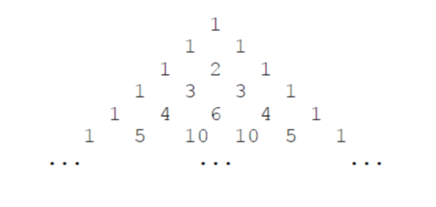

# B组真题

##  题目结构

|    题目     |   类型   | 分值 |
| :---------: | :------: | :--: |
| 第一题 空间 | 结果填空 | 5分  |
|   第二题    | 结果填空 | 5分  |
|   第三题    | 结果填空 | 10分  |
|   第四题    | 结果填空 | 10分 |
|   第五题    | 结果填空 | 15分 |
|   第六题    | 程序设计 | 15分 |
|   第七题    | 程序设计 | 20分 |
|   第八题    | 程序设计 | 20分 |
|   第九题    | 程序设计 | 25分 |
|   第十题    | 程序设计 | 25分 |

****

## 第一题 空间

* **问题描述**

  >小蓝准备用 256MB 的内存空间开一个数组，数组的每个元素都是 32 位二进制整数，如果不考虑程序占用的空间和维护内存需要的辅助空间，请问256MB 的空间可以存储多少个 32 位二进制整数？

* **解题思路**

  ​	$1MB=2^{10}KB=2^{20}B=2^{20}\times 8 bit$。换算输出即可。

* **答案**

  $67108864$

****

## 第二题 卡片

* **问题描述**

  >小蓝有很多数字卡片，每张卡片上都是数字 0 到 9。小蓝准备用这些卡片来拼一些数，他想从 1 开始拼出正整数，每拼一个，就保存起来，卡片就不能用来拼其它数了。小蓝想知道自己能从 1 拼到多少。例如，当小蓝有 30 张卡片，其中 0 到 9 各 3 张，则小蓝可以拼出 1 到 10，但是拼 11 时卡片 1 已经只有一张了，不够拼出 11。现在小蓝手里有 0 到 9 的卡片各 2021 张，共 20210 张，请问小蓝可以从 1拼到多少？提示：建议使用计算机编程解决问题。

* **解题思路**

  直接模拟到用不完为止，注意细节，最后退出的数需要减$1$，因为我们拼不成。

* **答案**

  $3181$

****

## 第三题 直线

* **问题描述**

  >在平面直角坐标系中，两点可以确定一条直线。如果有多点在一条直线上，那么这些点中任意两点确定的直线是同一条。给定平面上 2 × 3 个整点 {(*x*, *y*)|0 ≤ *x* < 2, 0 ≤ *y* < 3, *x* ∈ Z, *y* ∈ Z}，即横坐标是 0 到 1 (包含 0 和 1) 之间的整数、纵坐标是 0 到 2 (包含 0 和 2) 之间的整数的点。这些点一共确定了 11 条不同的直线。给定平面上 20 × 21 个整点 {(*x*, *y*)|0 ≤ *x* < 20, 0 ≤ *y* < 21, *x* ∈ Z, *y* ∈ Z}，即横坐标是 0 到 19 (包含 0 和 19) 之间的整数、纵坐标是 0 到 20 (包含 0 和 20) 之间的整数的点。请问这些点一共确定了多少条不同的直线。

* **解题思路**
  
  写错了，以为是找规律，考试的时候推的公式为$n+m+(n-1)*n/2*(m-1)*m/2*2$。正确解法应该可推公式，不过也可以直线判重解决这道题。
* **答案**
  
  $40257$
## 第四题 货物摆放

* **问题描述**

  >小蓝有一个超大的仓库，可以摆放很多货物。现在，小蓝有 *n* 箱货物要摆放在仓库，每箱货物都是规则的正方体。小蓝规定了长、宽、高三个互相垂直的方向，每箱货物的边都必须严格平行于长、宽、高。小蓝希望所有的货物最终摆成一个大的立方体。即在长、宽、高的方向上分别堆 *L*、*W*、*H* 的货物，满足 *n* = *L* × *W* × *H*。给定 *n*，请问有多少种堆放货物的方案满足要求。例如，当 *n* = 4 时，有以下 6 种方案：1×1×4、1×2×2、1×4×1、2×1×2、 2 × 2 × 1、4 × 1 × 1。请问，当 *n* = 2021041820210418 （注意有 16 位数字）时，总共有多少种方案？提示：建议使用计算机编程解决问题。

* **解题思路**

  枚举因子，由于不同顺序是不同的方案，所以我们先要假定$i\leq j \leq k$，然后最后我们就可以对$i,j,k$排列了，这样所有的情况都会被考虑，而因为都不相同的时候是$6$种排列，只有相同的时候是$3$种排列，都相同的时候是一种排列。所以我们需要统计满足条件的数目$cnt0$、满足条件的数目且其中有且仅有两个相同的数目$cnt1$、满足条件的数目有且仅有三个相同的数目$cnt2$。最后答案即是$cnt0\times 6-cnt1\times 3 - cnt2\times 5$。

* **答案**

  $2430$

****

## 第五题 路径

* **问题描述**

  >小蓝学习了最短路径之后特别高兴，他定义了一个特别的图，希望找到图中的最短路径。小蓝的图由 2021 个结点组成，依次编号 1 至 2021。对于两个不同的结点 *a*, *b*，如果 *a* 和 *b* 的差的绝对值大于 21，则两个结点之间没有边相连；如果 *a* 和 *b* 的差的绝对值小于等于 21，则两个点之间有一条长度为 *a* 和 *b* 的最小公倍数的无向边相连。例如：结点 1 和结点 23 之间没有边相连；结点 3 和结点 24 之间有一条无向边，长度为 24；结点 15 和结点 25 之间有一条无向边，长度为 75。请计算，结点 1 和结点 2021 之间的最短路径长度是多少。提示：建议使用计算机编程解决问题。

* **解题思路**

  最短路模板题。本题我采用$dijkstra$算法实现的。

* **答案**

  $10266387$

## 第六题 时间显示

* **问题描述**

  >小蓝要和朋友合作开发一个时间显示的网站。在服务器上，朋友已经获取了当前的时间，用一个整数表示，值为从 1970 年 1 月 1 日 00:00:00 到当前时刻经过的毫秒数。现在，小蓝要在客户端显示出这个时间。小蓝不用显示出年月日，只需要显示出时分秒即可，毫秒也不用显示，直接舍去即可。给定一个用整数表示的时间，请将这个时间对应的时分秒输出。
  >
  >【输入格式】
  >
  >输入一行包含一个整数，表示时间。
  >
  >【输出格式】
  >
  >输出时分秒表示的当前时间，格式形如 HH:MM:SS，其中 
  >
  >HH 表示时，值
  >
  >为 0 到 23，MM 表示分，值为 0 到 59，SS 表示秒，值为 0 到 59。时、分、秒
  >
  >不足两位时补前导 0。
  >
  >【样例输入 **1**】
  >
  >46800999
  >
  >【样例输出 **1**】
  >
  >13:00:00
  >
  >【样例输入 **2**】
  >
  >1618708103123
  >
  >【样例输出 **2**】
  >
  >01:08:23
  >
  >【评测用例规模与约定】
  >
  >对于所有评测用例，给定的时间为不超过 1018 的正整数。

* **解题思路**

  水题，转换时间。注意：$1s=1000ms$。

* **AC代码**

****

## 第七题 砝码称重

* **问题描述**

  >你有一架天平和 *N* 个砝码，这 *N* 个砝码重量依次是 *W*1, *W*2, · · · , *W**N*。请你计算一共可以称出多少种不同的重量？注意砝码可以放在天平两边。
  >
  >【输入格式】
  >
  >输入的第一行包含一个整数 *N*。
  >
  >第二行包含 *N* 个整数：*W*1, *W*2, *W*3, · · · , *W**N*。
  >
  >【输出格式】
  >
  >输出一个整数代表答案。
  >
  >【样例输入】
  >
  >3
  >
  >1 4 6
  >
  >【样例输出】
  >
  >10
  >
  >【样例说明】
  >
  >能称出的 10 种重量是：1、2、3、4、5、6、7、9、10、11。
  >
  >1 = 1；
  >
  >2 = 6 − 4 (天平一边放 6，另一边放 4)；
  >
  >3 = 4 − 1；
  >
  >4 = 4；
  >
  >5 = 6 − 1；
  >
  >6 = 6；
  >
  >7 = 1 + 6；
  >
  >9 = 4 + 6 − 1；
  >
  >10 = 4 + 6；
  >
  >11 = 1 + 4 + 6。
  >
  >【评测用例规模与约定】
  >
  >对于 50% 的评测用例，1 ≤ *N* ≤ 15。
  >
  >对于所有评测用例，1 ≤ *N* ≤ 100，*N* 个砝码总重不超过 100000。

* **解题思路**

  我们可以先来定义一下，我们总认为称出的重量为左边减右边，也就是说如果要增加就放左边，如果要减少就放右边，否则放。

  这种决策问题一看就是$dp$了，然而比赛的时候也还是不知道该怎么处理，于是用dfs枚举。能过一半的样例。

* $dfs$捡分代码

****

## 第八题 杨辉三角形

* **问题描述**

  >下面的图形是著名的杨辉三角形：
  >
  >
  >
  >如果我们按从上到下、从左到右的顺序把所有数排成一列，可以得到如下数列：
  >
  >1, 1, 1, 1, 2, 1, 1, 3, 3, 1, 1, 4, 6, 4, 1, ...
  >
  >给定一个正整数 *N*，请你输出数列中第一次出现 *N* 是在第几个数？
  >
  >【输入格式】
  >
  >输入一个整数 *N*。
  >
  >【输出格式】
  >
  >输出一个整数代表答案。
  >
  >【样例输入】
  >
  >6
  >
  >【样例输出】
  >
  >13
  >
  >【评测用例规模与约定】
  >
  >对于 20% 的评测用例，1 ≤ *N* ≤ 10；
  >
  >对于所有评测用例，1 ≤ *N* ≤ 1000000000。

* **解题思路**

  杨辉三角第$i$行第$j$列的数为$C_{i-1}^{j}$，那么我们直接枚举$i,j$即可。不过有一个坑点，比赛的时候没想到，就是$C_{n}^1$的时候，需要枚举$O(n^2)$，故需要特判处理，没有想到。哎，只能过的$20\%$的分。

* **代码**

****

## 第九题 双向排序

* **问题描述**

  >给定序列 (*a*1, *a*2, · · · , *an*) = (1, 2, · · · , *n*)，即 $a_i$ = *i*。小蓝将对这个序列进行 *m* 次操作，每次可能是将 *a*1, *a*2, · · · , *a**q**i* 降序排列，或者将 *a**q**i* , *a**q**i*+1, · · · , *a**n* 升序排列。请求出操作完成后的序列。
  >
  >【输入格式】
  >
  >输入的第一行包含两个整数 *n*, *m*，分别表示序列的长度和操作次数。
  >
  >接下来 *m* 行描述对序列的操作，其中第 *i* 行包含两个整数 *p**i*, *q**i* 表示操作类型和参数。当 *p**i* = 0 时，表示将 *a*1, *a*2, · · · , *a**q**i* 降序排列；当 *p**i* = 1 时，表示将 *a**q**i* , *a**q**i*+1, · · · , *a**n* 升序排列。
  >
  >【输出格式】
  >输出一行，包含 *n* 个整数，相邻的整数之间使用一个空格分隔，表示操作完成后的序列。
  >
  >【样例输入】
  >
  >3 3
  >
  >0 3
  >
  >1 2
  >
  >0 2
  >
  >【样例输出】
  >
  >3 1 2
  >
  >【样例说明】
  >
  >原数列为 (1, 2, 3)。 
  >
  >第 1 步后为 (3, 2, 1)。 
  >
  >第 2 步后为 (3, 1, 2)。 
  >
  >第 3 步后为 (3, 1, 2)。与第 2 步操作后相同，因为前两个数已经是降序了。
  >
  >【评测用例规模与约定】
  >
  >对于 30% 的评测用例，*n*, *m* ≤ 1000；
  >
  >对于 60% 的评测用例，*n*, *m* ≤ 5000；
  >
  >对于所有评测用例，1 ≤ *n*, *m* ≤ 100000，0 ≤ *pi* ≤ 1，1 ≤ *qi* ≤ *n*。

* **解题思路**

  有点线段树的味道，但不知道怎么处理，所以采用暴力去做，能过$30\%$的数据。

* **代码**

****

## 第十题 括号序列

* **问题描述**

  >给定一个括号序列，要求尽可能少地添加若干括号使得括号序列变得合法，当添加完成后，会产生不同的添加结果，请问有多少种本质不同的添加结果。两个结果是本质不同的是指存在某个位置一个结果是左括号，而另一个是右括号。例如，对于括号序列 ((()，只需要添加两个括号就能让其合法，有以下几种不同的添加结果：()()()、()(())、(())()、(()()) 和 ((()))。
  >
  >【输入格式】
  >
  >输入一行包含一个字符串 *s*，表示给定的括号序列，序列中只有左括号和右括号。
  >
  >【输出格式】
  >
  >输出一个整数表示答案，答案可能很大，请输出答案除以 1000000007 (即109 + 7) 的余数。
  >
  >【样例输入】
  >
  >((()
  >
  >【样例输出】
  >
  >5
  >
  >【评测用例规模与约定】
  >
  >对于 40% 的评测用例，|*s*| ≤ 200。
  >
  >对于所有评测用例，1 ≤ |*s*| ≤ 5000。

* **解题思路**

  持续懵逼中，偷分都不知道怎么偷，待补。

* **代码**

# 总结

  整体还算OK，待结果出来还愿。